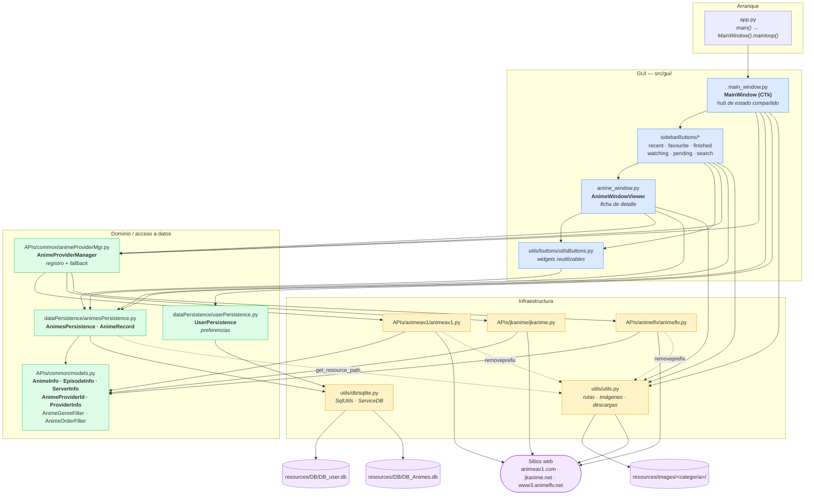

# 01 — Arquitectura

| | |
|---|---|
| **Fecha** | 2026-08-16 · **Commit** `a3d4331` (2026-08-17, rama `main`) · árbol **limpio** |
| **Última revisión** | 2026-08-16 (**columna `provider_id`**): `DB_user.db` incorporada al diagrama, **I9 nuevo** (el proveedor es un tipo, no una cadena), §5 con las dos BD y §7 corregido — sí hay migraciones y sí hay configuración persistida |
| **Cubre** | `src/app.py`, `src/APIs/**`, `src/dataPersistence/**`, `src/gui/**`, `src/utils/**` |

Procedencia: ✅ verificado en ejecución · 📖 leído en código · ⚠️ sin verificar.

---

## 1. Las cuatro capas



---

## 2. Dependencias: permitidas y prohibidas

📖 Reglas deducidas de los `import` reales de los 19 módulos.

| Desde | Puede importar | **Nunca debe importar** |
|---|---|---|
| `gui/**` | `APIs.common.*`, `dataPersistence.*`, `utils.*` | `APIs.animeflv.*` / `APIs.animeav1.*` / `APIs.jkanime.*` **salvo `main_window.py`** |
| `APIs/<sitio>/` | `APIs.common.*`, `utils.utils` | cualquier cosa de `gui/` o `dataPersistence/` |
| `APIs/common/` | solo stdlib + `requests` | `utils.*`, `gui/**`, `dataPersistence/**` |
| `dataPersistence/` | `APIs.common.models`, `utils.db.sqlite`, `utils.utils` | `gui/**`, `APIs/<sitio>/` |
| `utils/db/sqlite.py` | solo stdlib (`os`, `sqlite3`) | todo lo demás |
| `utils/utils.py` | stdlib + `PIL` + `requests` + `customtkinter` | `gui/**`, `APIs/**`, `dataPersistence/**` |
| `utils/buttons/utilsButtons.py` | `APIs.common.models`, `dataPersistence.*`, `utils.utils` | `APIs/<sitio>/`, `gui/**` |

**La única excepción legítima** 📖: `gui/main_window.py` importa los **tres** proveedores concretos
para registrarlos. Es el *composition root*. Ningún otro módulo de `gui/` debe conocer un sitio
concreto.

```python
# gui/main_window.py  — el ÚNICO sitio donde la GUI nombra un proveedor concreto.
# El orden de registro ES el orden del fallback.
self.anime_provider_mgr.register(AnimeAV1Singleton(), default=True)
self.anime_provider_mgr.register(JKAnimeSingleton())    # 2026-08-06
self.anime_provider_mgr.register(AnimeFLVSingleton())
```

> ✅ **JKAnime se registró en medio a propósito** (2026-08-06). Hasta entonces el fallback tenía una
> sola parada y estaba en desuso, así que en la práctica no existía. Cambiar este orden cambia a
> quién se recurre cuando el predeterminado falla.

**Ciclo tolerado** 📖: `dataPersistence/animesPersistence.py:15` importa `utils.utils.get_resource_path`,
y `utils/buttons/utilsButtons.py:10` importa `dataPersistence`. No hay ciclo real porque
`utils/utils.py` no importa nada del proyecto.

---

## 3. Invariantes de diseño

### I1 — El código de GUI nunca habla con un sitio concreto
📖 Todas las vistas obtienen datos por `AnimeProviderManagerSingleton()`. Los wrappers del manager
tienen la misma firma que `AnimeProvider` más `provider_id=` y `strict=`
(`APIs/common/animeProviderMgr.py:336-382`).

### I2 — `APIs/common/models.py` es la única fuente de verdad de los tipos de dominio
📖 `models.py:1-6`. Ningún proveedor redefine `AnimeInfo`, `EpisodeInfo` ni `ServerInfo`. Si un sitio
usa slugs de género distintos, **el proveedor traduce internamente**; quien llama siempre pasa el
enum común (`animeProviderMgr.py:37-41`).

### I3 — El manager nunca propaga excepciones
✅ Verificado. `call_with_fallback` captura todo y devuelve `(None, None)` si nadie responde
(`animeProviderMgr.py:293-334`). Los wrappers convierten ese `None` en `[]`, `None` o `([], 1)`.
**Consecuencia**: la GUI no distingue «sitio caído» de «no hay resultados». Detalle exacto en
[05 §5](05-proveedores-y-scraping.md).

### I4 — Dos tipos distintos según el origen del dato
📖 `AnimeInfo` = lo que viene de la red. `AnimeRecord` = lo que está en BD. **No son
intercambiables** (`anime_record.anime_id` vs `anime_info.id`; `poster_url` vs `poster`).
Tabla campo a campo en [04 §1](04-modelo-de-datos.md).

### I5 — Estado compartido en `MainWindow`, sin router
📖 No hay gestor de vistas. Cada vista recibe `main_window` y muta su estado directamente
(`main_window.py:87-93`). `content_frame` es **un único `CTkScrollableFrame`** que todas las vistas
vacían y repueblan (`main_window.py:141-152`).

### I6 — Nada de HTTP en el hilo de Tkinter
📖 Toda petición va en un hilo daemon. Ver [07](07-concurrencia-e-hilos.md) — con las excepciones
reales que incumplen esta regla hoy.

### I7 — El cwd es irrelevante
✅ `get_resource_path()` calcula la raíz del proyecto desde la ubicación de `src/utils/utils.py`,
no desde el directorio de trabajo (`utils/utils.py:204-217`). Bajo PyInstaller usa `sys._MEIPASS`.

### I8 — Una conexión SQLite por operación
📖 `utils/db/sqlite.py` abre y cierra en cada método; no hay pool ni transacciones multi-sentencia
**salvo en las migraciones**. Los errores se **imprimen**, no se lanzan; los métodos devuelven `bool`.

### I9 — El proveedor es un tipo, no una cadena 🆕 *(2026-08-16)*
📖 `AnimeProviderId` (`models.py:18-31`) es el tipo del proveedor en **todas** las firmas del manager,
en `AnimeInfo.provider_id` y en la columna `ANIMES.provider_id`. Solo se degrada a texto en **dos
fronteras**, ambas de persistencia: `USER_SETTINGS.default_anime_provider` y la propia columna
([04 §0](04-modelo-de-datos.md)).

**Las dos vueltas toleran basura**: un valor que ya no corresponde a ningún miembro se ignora con un
aviso y se sigue funcionando. Un proveedor retirado del código no puede impedir arrancar ni leer la
biblioteca.

**Consecuencia de diseño**: el `value` de cada miembro queda escrito en la biblioteca del usuario en
cuanto guarda un anime desde ese proveedor. Cambiarlo después convierte esas filas en «proveedor
desconocido». Es la única constante del proyecto que es **de facto inmutable**.

---

## 4. Registro de proveedores hoy

✅ AnimeAV1 y AnimeFLV verificados contra los sitios reales el 2026-07-28; **JKAnime el 2026-08-06**.

| Orden | `PROVIDER_ID` | Rol | Estado observado |
|---|---|---|---|
| 1 | `AnimeProviderId.ANIMEAV1` | **Por defecto** | Los 5 métodos responden correctamente |
| 2 | `AnimeProviderId.JKANIME` | **Primer fallback** | Los 5 métodos responden; 50/50 comprobaciones ([09 §3d](09-verificacion-y-pruebas.md)) |
| 3 | `AnimeProviderId.ANIMEFLV` | Último fallback | Listados y ficha OK; **`get_anime_episode_servers` devuelve `[]`** |

🆕 **El orden de registro ya no es lo único que decide.** Un anime **guardado** se abre por el
proveedor que consta en su fila, y una desviación del desplegable gana a las dos cosas
([13 §8](13-selector-de-proveedor.md)). El orden de registro sigue mandando en lo no guardado
—portada, búsquedas— y como último recurso cuando falla el proveedor pedido.

⚠️ **Registrar un proveedor exige ahora un miembro en `AnimeProviderId`** (`models.py:18-31`), o el
módulo no importa. El `value` de ese miembro **se persiste** en la biblioteca del usuario: es una
decisión permanente ([11 §3](11-playbooks.md)).

El usuario confirma que **AnimeFLV está caído / en desuso**. Hasta la llegada de JKAnime
(2026-08-06) el fallback tenía una sola parada y era precisamente esa, así que **en la práctica no
existía**. Detalle de los tres en [05 §2 y §3b](05-proveedores-y-scraping.md).

---

## 5. Persistencia: dos bases de datos

📖 `dataPersistence/animesPersistence.py:239-256`. Tabla única `ANIMES` en
`resources/DB/DB_Animes.db`. `start()` crea el fichero si no existe y **después llama siempre a
`validate_db_integrity()`**, que alinea el esquema físico con el declarado.

| BD | Clase | Contenido | Reemplazable |
|---|---|---|---|
| `DB_Animes.db` | `AnimesPersistence` | tabla `ANIMES`: la biblioteca real | ❌ irrecuperable |
| `DB_user.db` | `UserPersistence` | tabla `USER_SETTINGS`: preferencias | ✅ se regenera |

El motor de migración de `utils/db/sqlite.py` es **genérico** y sirve a las dos: `ServiceDB` no sabe
nada de animes. Por qué están separadas: [13 D1](13-selector-de-proveedor.md).

> ✅ **Sí hay migraciones (desde 2026-07-30).** El esquema declarado vive en
> `AnimesPersistence.SCHEMA` (lista de `TableSchema`) y `validate_db_integrity()` corrige la BD en
> caliente: crea tablas que falten, añade columnas con `ALTER TABLE` y reconstruye la tabla cuando
> cambia el orden o la afinidad de tipo, copiando los datos **por nombre de columna** y dejando una
> copia de seguridad en `resources/DB/backups/`. Ver [04 §3](04-modelo-de-datos.md),
> [11 §2](11-playbooks.md) y trampa 2.

---

## 6. Dependencias externas

📖 `requirements.txt`:
`beautifulsoup4==4.12.3` · `Pillow==11.0.0` · `Requests==2.32.3` · `pyinstaller==6.11.0` ·
`customtkinter==5.2.2` · `typing_extensions==4.12.2`

✅ **La lista está completa** (2026-07-28): `src/` no importa nada fuera de la stdlib y de esos seis
paquetes.

> **Histórico**: hasta 2026-07-28 `searchAnimes.py:15` hacía `from attr import dataclass`, del
> paquete **`attrs`**, que no estaba declarado y solo existía en el entorno como transitiva de
> `selenium`. Se sustituyó por `dataclasses` de la stdlib. Ver trampa 18b y
> [12 §4 → Resuelto](12-deuda-tecnica-y-roadmap.md).

---

## 7. Qué NO existe en este proyecto

Para evitar que alguien lo busque:

- ❌ Tests, linter, formateador, CI. `TESTS/` está en `.gitignore` y es material de terceros.
- ❌ Logging estructurado — se usa `print` (📖, en todos los módulos).
- ❌ Router de vistas, inyección de dependencias.
- ❌ Backend propio, API, autenticación, telemetría. Todo el estado es local.
- ❌ Restricciones de integridad en `ANIMES`: **ni `UNIQUE`, ni `NOT NULL`, ni claves foráneas**. Lo
  que impide duplicar una fila son comprobaciones en Python ([trampa 28](10-invariantes-y-trampas.md)).
- ❌ Cualquier módulo de manga. El roadmap lo prevé, el código aún no lo contempla.

> ⚠️ **Dos entradas de esta lista caducaron y se han retirado**: «migraciones de BD» (existen desde
> 2026-07-30, §5) y «config de usuario persistida» (existe desde 2026-07-30 en `DB_user.db`). Si las
> ves citadas en otro documento, es texto anterior a esa fecha.
