# 03 — Flujos de ejecución

| | |
|---|---|
| **Fecha** | 2026-08-16 · **Commit** `a3d4331` (2026-08-17, rama `main`) · árbol **limpio** |
| **Última revisión** | 2026-08-16 (**columna `provider_id`**): §3 pasa de 2 caminos a **3, todos asíncronos**; **flujo 10 nuevo** (migrar una fila a otro proveedor); anclas de `anime_window.py` reubicadas tras crecer a 1 155 líneas |
| **Cubre** | `main_window.py`, `anime_window.py`, `recentAnimes.py`, `searchAnimes.py`, las 4 vistas de estado, `animeProviderMgr.py`, `animesPersistence.py`, `utils.py` |

Procedencia: ✅ verificado en ejecución · 📖 leído en código · ⚠️ sin verificar.
**Convención de hilos**: 🖥️ = hilo de Tkinter (UI) · 🧵 = hilo daemon · ⚙️ = worker del `ThreadPoolExecutor`.

---

## 1. Arranque y pantalla de carga

✅ Verificado: la app arranca, abre la ventana «Mi Biblioteca de Anime» y muestra los recientes sin
traceback.

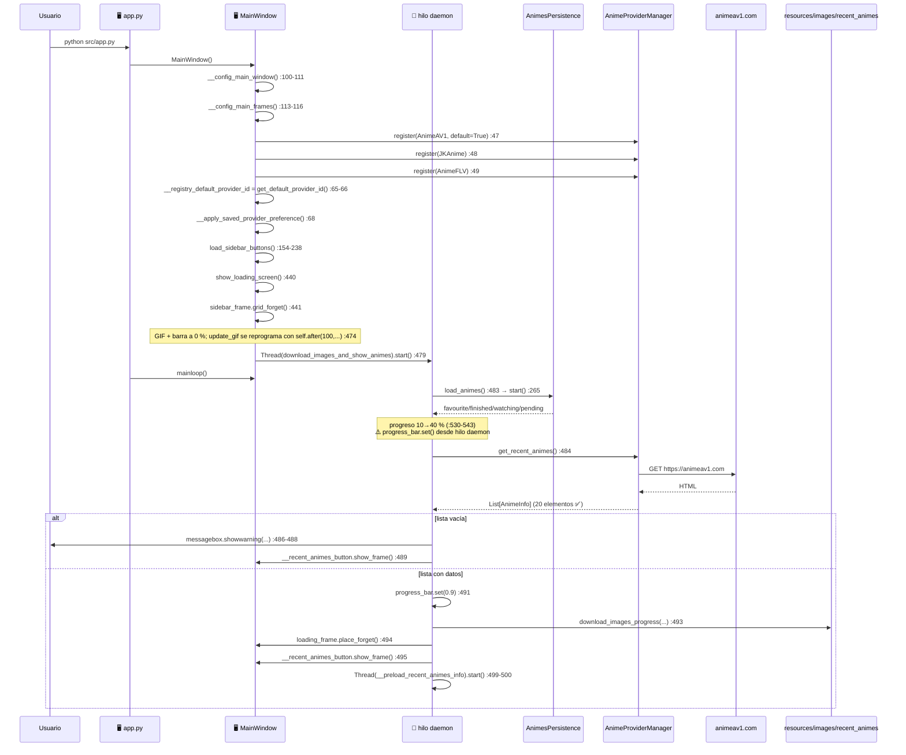

**Notas ancladas**

- `show_frame()` de `RecentAnimeButton` (`recentAnimes.py:29-34`) **revela la sidebar** con
  `sidebar_frame.grid(...)` (`:31`) antes de pintar. Es el único sitio donde reaparece.
- 📖 Los `progress_bar.set()` / `configure()` de `load_animes` (`main_window.py:530-543`) y el
  `messagebox.showwarning` (`:486`) corren en **hilo daemon** ([07 §4](07-concurrencia-e-hilos.md)).
- 🆕 El paso `__registry_default_provider_id` (`:65-66`) va **antes** de aplicar la preferencia
  guardada, y no es cosmético: `__apply_saved_provider_preference()` llama a `set_default()`, que lo
  pisaría. Es la referencia contra la que se mide si el desplegable está desviado
  ([13 §8](13-selector-de-proveedor.md)).
- ✅ El arranque **no escribe** en la BD: el `LastWriteTime` de `DB_Animes.db` no cambió.

---

## 2. Precarga de la info de los recientes

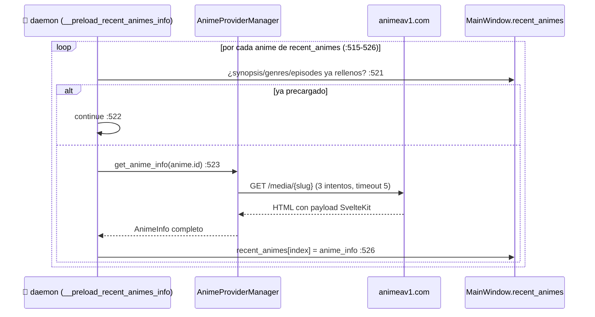

📖 `main_window.py:502-528`. El código justifica la ausencia de `Lock` (`:507-513`): asignar un
elemento de lista es atómico en CPython. ✅ Con AnimeAV1 cada `get_anime_info` tarda ~0,5 s → los 20
recientes ≈ 10 s de precarga en serie.

---

## 3. Clic en un anime → ficha de detalle

Hay **tres** caminos, según la vista. 🆕 Desde el 2026-08-16 los tres son **asíncronos** y los tres
vuelven al hilo de Tkinter con `after(0, …)`; lo que cambia es **cómo se decide el proveedor**.

| Vista | Proveedor | Por qué |
|---|---|---|
| **3a** Recientes | el que trajo la portada (`anime_clicked.provider_id`) | el slug es suyo |
| **3b** Las 4 de estado | `provider_for_saved_anime()` — puede re-resolver por título | el slug es del proveedor que **guardó la fila** |
| **3c** Buscador | el que sirvió el resultado | el slug es de **ese** sitio |

### 3a. Desde «Animes recientes»

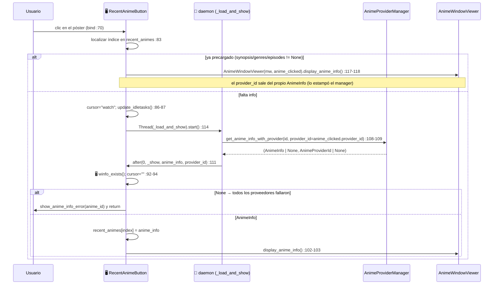

> ✅ **Corregido en `1bfdf0f`** (2026-07-30) el caso `None`, que antes caía de vuelta al objeto obsoleto
> de `recent_animes` y petaba. 🆕 **Corregido el 2026-08-16** que el repintado ocurría en el hilo
> daemon: ahora vuelve con `after(0, …)` ([07 C2](07-concurrencia-e-hilos.md)).

### 3b. Desde favoritos / finalizados / viendo / pendientes 🆕

📖 `open_saved_anime()` (`anime_window.py:108-193`). Las cuatro vistas se limitan a llamarlo.

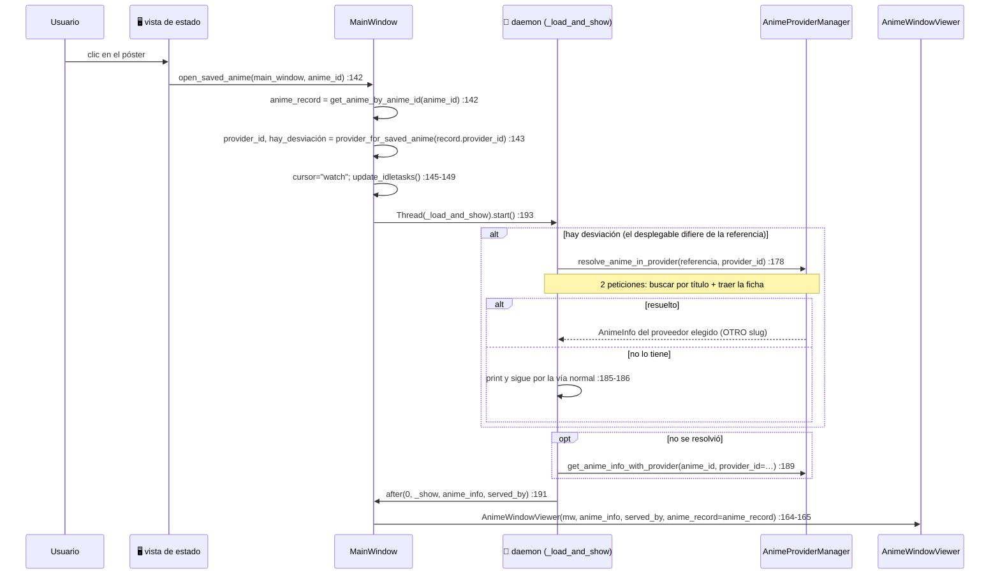

🔴 **El `anime_record=` del último paso no es opcional.** Con el desplegable desviado, `anime_info.id`
es el slug de **otro** sitio; sin la fila, la ficha congelaría la identidad de persistencia sobre ese
slug ajeno, se mostraría como no guardada y el primer botón de estado insertaría una **fila
duplicada**. Es la [trampa 21](10-invariantes-y-trampas.md), y ocurrió de verdad durante la fase 4.

⚠️ Cuando el proveedor elegido **no tiene** el anime no se bloquea al usuario: se sigue por la vía
normal y la ficha muestra quién lo ha servido de verdad.

### 3c. Desde el buscador 🆕

📖 `searchAnimes.py:344-382`. Igual que 3a en estructura, pero **arrastrando el `provider_id` del
resultado** desde el `bind` del póster (`:254-259`):

```python
img_label.bind("<Button-1>",
               lambda e, anime_id=anime.id, provider_id=anime.provider_id:
               self.__on_anime_click(anime_id, provider_id))
```

Sin eso se le pediría al predeterminado un slug que puede no ser suyo, **y habría que esperar sus
reintentos** —AnimeAV1 hace 3 con `sleep(1)`— antes de que entrase el fallback.

> No usa `open_saved_anime()` a propósito: un resultado de búsqueda no tiene por qué estar en la
> biblioteca, y aquí el proveedor **no se decide**, ya se sabe.

### 3d. Qué hace la ficha al mostrarse

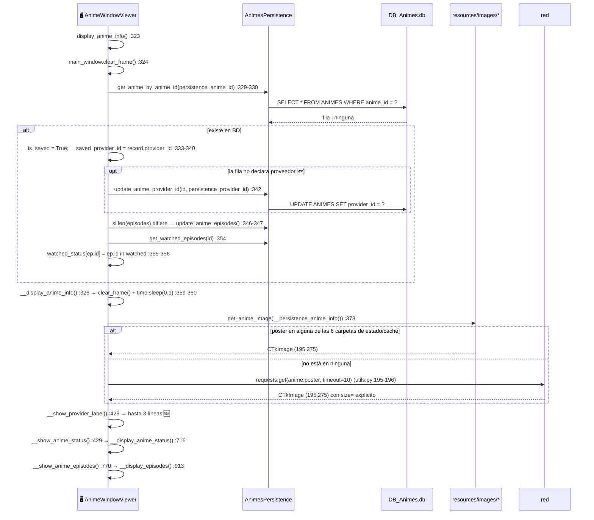

🆕 **El autorrelleno del proveedor ocurre aquí**, y **solo si la columna estaba a `NULL`**: si la fila
ya declara proveedor, cambiarlo es una decisión explícita del usuario (el botón «Actualizar a …»), no
algo que deba pasar por el hecho de abrir la ficha. Ver [04 §8](04-modelo-de-datos.md).

⚠️ El póster se pide con `__persistence_anime_info()`, no con `anime_info`: así sigue encontrando el
`{anime_id}.jpg` ya cacheado aunque se esté mostrando la ficha de otro proveedor.

---

## 4. Marcar / desmarcar un episodio

📖 `anime_window.py:1052-1105`. Es el flujo más delicado del proyecto.

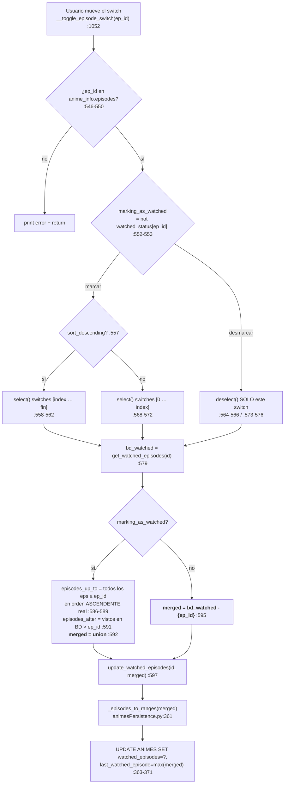

**Reglas que hay que respetar** (✅ round-trip verificado):

1. **Marcar es acumulativo**: marca todos los episodios **anteriores en orden real ascendente**, no
   los anteriores en pantalla (`:586-589`). Es correcto tanto si la lista está ascendente como
   descendente.
2. **Los episodios posteriores ya vistos se conservan** (`:591`).
3. **Desmarcar es unitario**: solo se quita ese episodio (`:595`).
4. `update_watched_episodes` **devuelve `False` y no escribe nada si el anime no está en BD**
   (`animesPersistence.py:358`). ✅ Verificado. Es decir: **marcar episodios de un anime sin
   estado asignado no persiste nada**.

> ⚠️ Los pasos 1 y 2 usan `self.episode_switches`, que solo contiene los **widgets visibles** (25 como
> mucho, o los filtrados por búsqueda). Con la lista filtrada a un único episodio, `index` viene de
> `anime_info.episodes` (`:547`) pero se indexa `self.episode_switches[index]` (`:559-562`, `:566`) →
> posible `IndexError`. Camino leído en código, no reproducido.

---

## 5. Cambios de estado (los 4 botones)

📖 `anime_window.py:830-903` + `animesPersistence.py:594-684`. ✅ Máquina de estados verificada
completa sobre una copia de la BD.

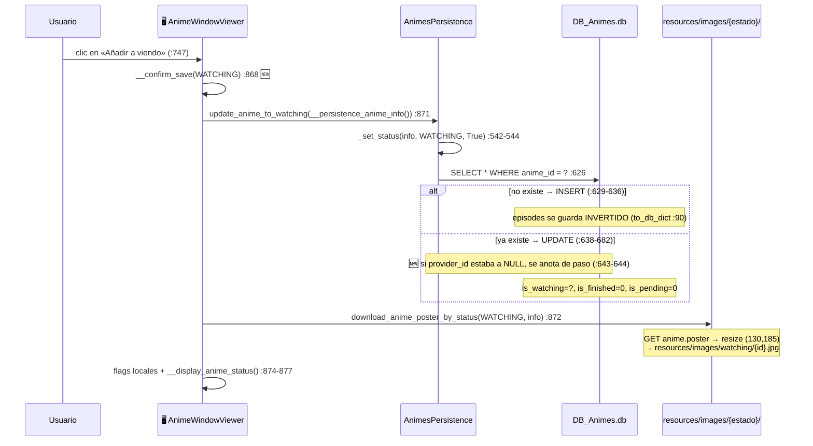

**Tabla de transiciones** ✅ verificada (líneas de `animesPersistence.py`):

| Acción | `fav` | `watch` | `fin` | `pend` | Línea |
|---|---|---|---|---|---|
| `update_anime_to_favourite` | **1** | = | = | = | `:531-533` |
| `update_anime_to_not_favourite` | **0** | = | = | = | `:535-540` |
| `update_anime_to_watching` | = | **1** | **0** | **0** | `:542-544` |
| `update_anime_to_not_watching` | = | **0** | = | `is_pending` previo | `:546-560` |
| `update_anime_to_finished` | = | **0** | **1** | **0** | `:562-564` |
| `update_anime_to_not_finished` | = | `is_watching` previo | **0** | **1** | `:566-581` |
| `update_anime_to_pending` | = | **0** | **0** | **1** | `:583-585` |
| `update_anime_to_not_pending` | = | = | = | **0** | `:587-592` |

⚠️ **`remove_from_*` no crea el anime**: usan `_update_flag` (`:605-612`), un `UPDATE` puro; si el
anime no está en BD, ✅ `update_sql` devuelve `True` sin haber tocado nada. `add_to_*` sí lo insertan
(`_set_status:628-636`).

⚠️ **El póster no se mueve de categoría.** Al hacer `remove_from_finished` el anime pasa a
*pendiente* en BD (`:566-581`) pero su póster se borra de `finished/` y **no** se crea en `pending/`
(`anime_window.py:859-865`) → la vista «pendientes» lo muestra en gris. Deuda B7 en
[12 §4](12-deuda-tecnica-y-roadmap.md).

---

## 6. Búsqueda por texto

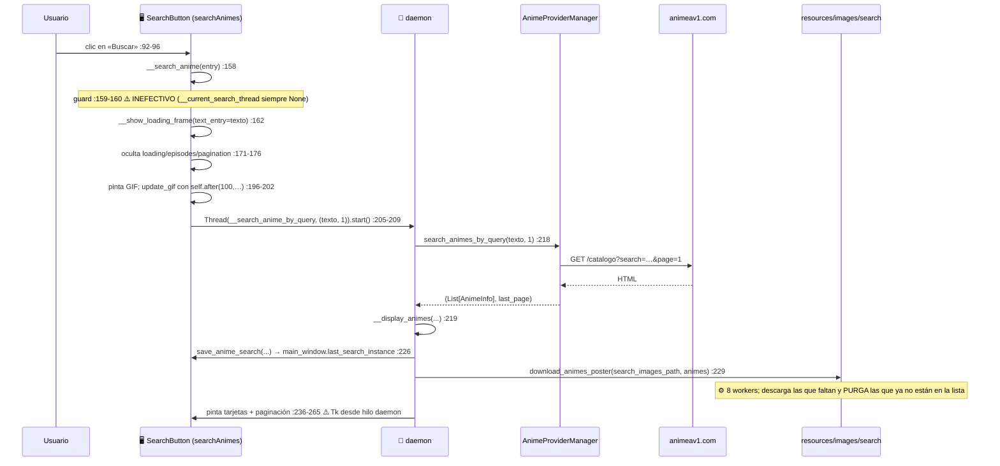

📖 `searchAnimes.py`. La condición `if text_entry == "" or text_entry is not None` (`:204`) equivale a
`text_entry is not None`: con texto (aunque sea vacío) va a búsqueda por query; con `None`, al filtro
por géneros.

---

## 7. Búsqueda por géneros + orden, con paginación

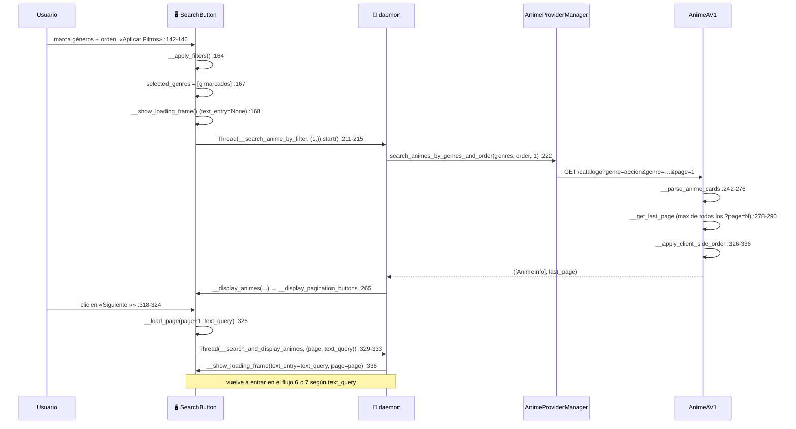

📖 Paginación: `:267-324`. `start_page = max(2, current_page)` (`:295`),
`end_page = min(start_page+3, last_page-1)` (`:296`); botones fijos «1» (`:286`) y `last_page`
(`:309`). ✅ `last_page` real observado: 50 (AnimeAV1) / 79 (AnimeFLV) para acción+aventura.

⚠️ Cuando todos los proveedores fallan, el wrapper devuelve `([], 1)` (`animeProviderMgr.py:262`).
El `1` es **una constante, no la última página real**: la paginación se colapsa a una sola página.

---

## 8. Obtención de servidores de un episodio

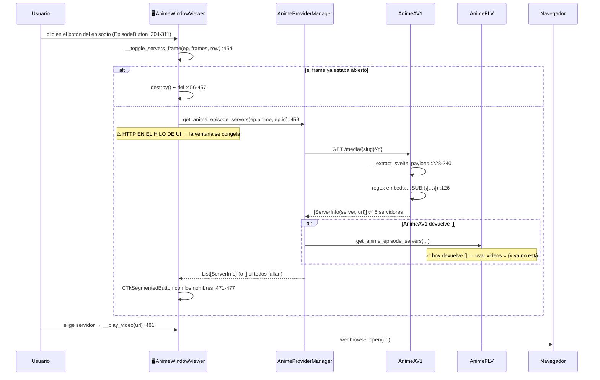

⚠️ `server_button.set(None)` (`:476`) se ejecuta **antes** de asignar el `command` (`:477`), así que no
dispara la reproducción al construirse. Si `servers_info` viene vacío, el `CTkSegmentedButton` se crea
sin valores y **no hay ningún aviso al usuario**.

---

## 9. Descarga y purga de pósters

✅ Verificado end-to-end.

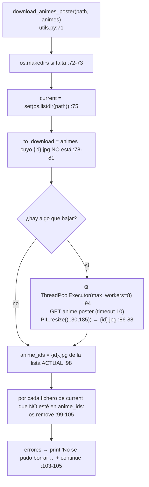

**Hechos verificados**

| Hecho | Resultado |
|---|---|
| Tamaño en disco | exactamente **130×185 JPEG** |
| Segunda llamada con los mismos animes | **0,00 s**, `mtime` intacto — no se re-descarga |
| Llamada con la lista reducida | los pósters sobrantes **se borran** |
| `download_images_progress` | idéntico + progreso `0.9 + 0.1·completados/total` (`:126`) |

⚠️ **La purga es agresiva**: `download_animes_poster` se usa también para `resources/images/search`
(`searchAnimes.py:229`), así que **cada búsqueda borra los pósters de la búsqueda anterior**.

⚠️ **La purga puede fallar en Windows.** ✅ `load_image` (`utils.py:181`) hace `Image.open(path)` sin
cerrar y PIL es perezoso: el fichero queda **abierto** mientras viva el `CTkImage` → `os.remove`
lanza `PermissionError`. Está capturado (`:103-105`), así que solo imprime. Además ✅ en la caché real
del usuario hay un huérfano `Chi.` (0 bytes) que `os.listdir` lista pero `os.remove` no puede borrar
(`WinError 2`) → **aviso en cada arranque**:

```
No se pudo borrar la imagen Chi.: [WinError 2] El sistema no puede encontrar el archivo
especificado: '…\resources\images\recent_animes\Chi.'
```

⚠️ El origen de ese fichero (un `anime.id` terminado en punto, que Windows no puede resolver) **no
está verificado**.

---

## 10. Migrar un anime guardado a otro proveedor 🆕 *(2026-08-16)*

📖 `anime_window.py:556-709`. Es el **único flujo que reescribe la identidad de una fila** de la
biblioteca, y por eso es el que más comprobaciones lleva.

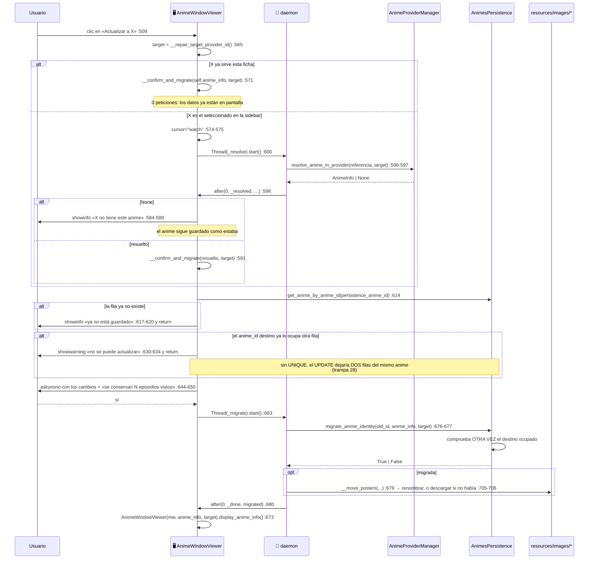

**Tres decisiones que se ven en el diagrama y conviene no revertir**:

1. **La comprobación del destino ocupado está en las dos capas.** En la GUI para poder **explicarla**;
   en persistencia porque `migrate_anime_identity` es pública y no puede fiarse de quien la llame.
2. **Al terminar se construye una ficha nueva**, no se retocan atributos. La identidad de persistencia
   se congela en el constructor y el resto de la clase la da por inmutable; mutarla a mano sería
   pedir la [trampa 21](10-invariantes-y-trampas.md) otra vez.
3. **Un fallo moviendo pósters no revierte la migración.** El peor caso es un recuadro gris hasta la
   próxima descarga; revertir una escritura de BD correcta por una imagen sería peor.

---

## 11. Flujos documentados en otro sitio

- **Cambio de tema claro/oscuro** (`main_window.py:428-438`) → [06 §5](06-gui-y-vistas.md).
- **Semántica interna del fallback entre proveedores** → [05 §5](05-proveedores-y-scraping.md).
- **Serialización de `episodes` y `watched_episodes`** → [04 §4](04-modelo-de-datos.md).
- 🆕 **Buscar dentro de la biblioteca** (`SavedAnimeSearch`) → [06 §7](06-gui-y-vistas.md).
