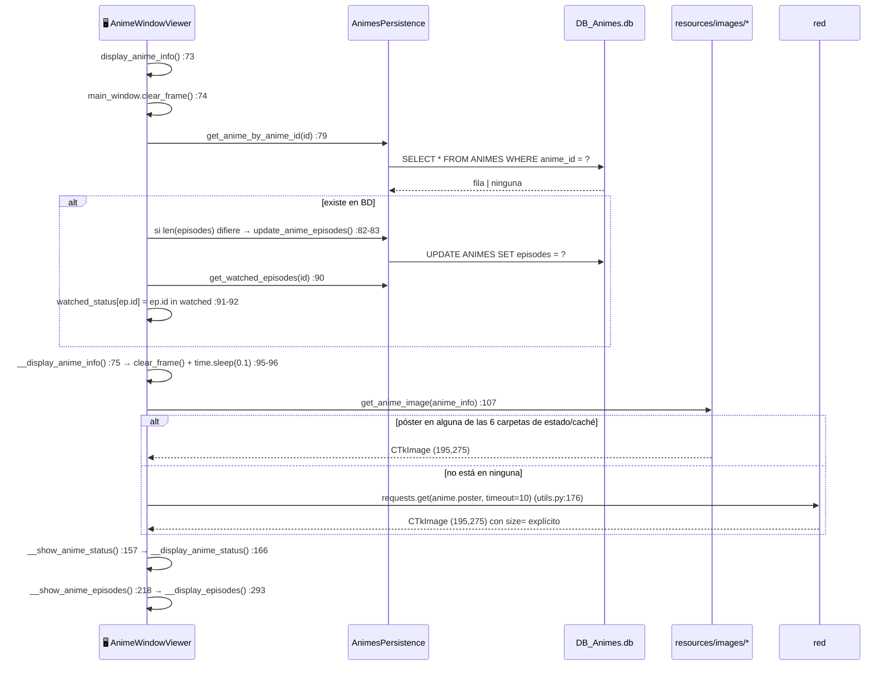
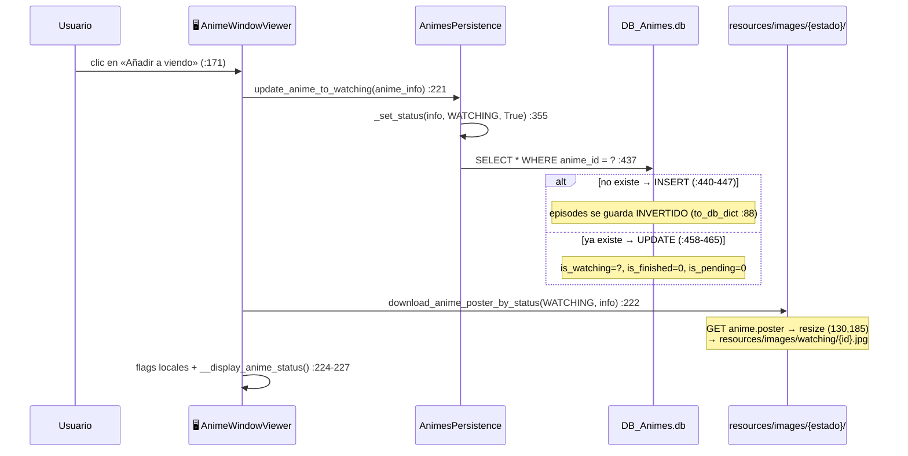
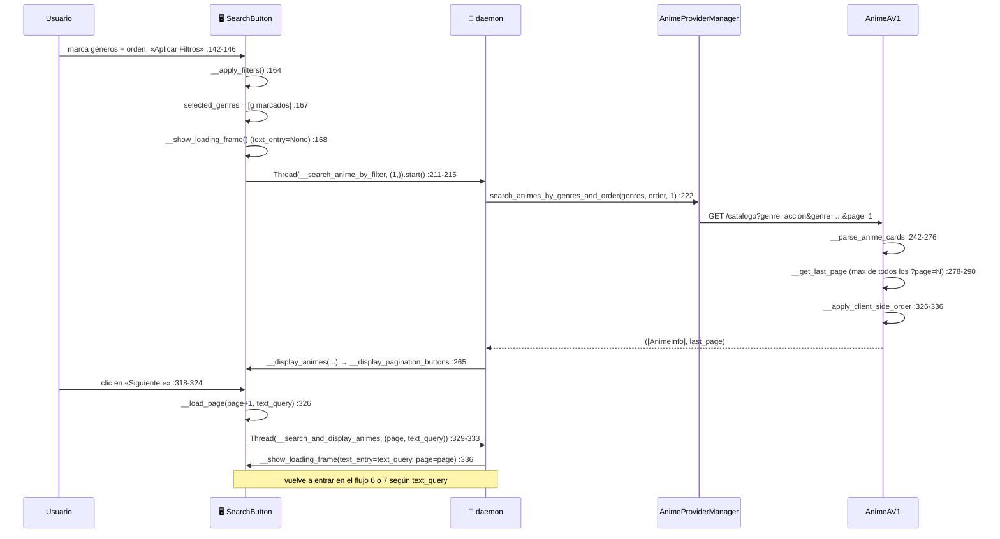
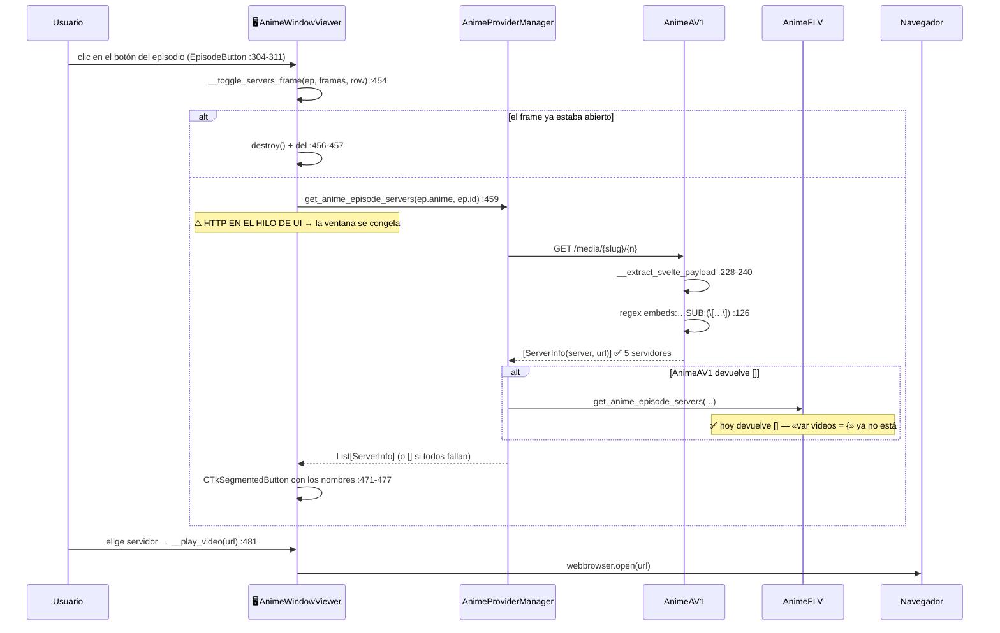
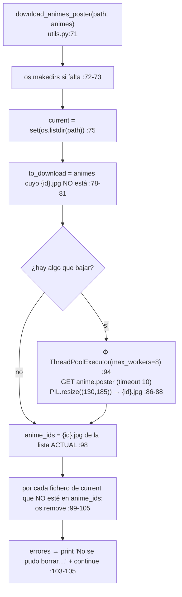

# 03 — Flujos de ejecución

| | |
|---|---|
| **Fecha** | 2026-07-30 · **Commit** `83a8448` · árbol **sucio** |
| **Última revisión** | 2026-07-30: flujos 3a, 3b y 3c actualizados tras `1bfdf0f` y `83a8448` |
| **Cubre** | `main_window.py`, `anime_window.py`, `recentAnimes.py`, `searchAnimes.py`, las 4 vistas de estado, `animeProviderMgr.py`, `animesPersistence.py`, `utils.py` |

Procedencia: ✅ verificado en ejecución · 📖 leído en código · ⚠️ sin verificar.
**Convención de hilos**: 🖥️ = hilo de Tkinter (UI) · 🧵 = hilo daemon · ⚙️ = worker del `ThreadPoolExecutor`.

---

## 1. Arranque y pantalla de carga

✅ Verificado: la app arranca, abre la ventana «Mi Biblioteca de Anime» y muestra los recientes sin
traceback.

```mermaid
sequenceDiagram
    participant U as Usuario
    participant APP as 🖥️ app.py
    participant MW as 🖥️ MainWindow
    participant T as 🧵 hilo daemon
    participant P as AnimesPersistence
    participant MGR as AnimeProviderManager
    participant NET as animeav1.com
    participant FS as resources/images/recent_animes

    U->>APP: python src/app.py
    APP->>MW: MainWindow()
    MW->>MW: __config_main_window() :71-82
    MW->>MW: __config_main_frames() :84-87
    MW->>MGR: register(AnimeAV1, default=True) :48
    MW->>MGR: register(AnimeFLV) :49
    MW->>MW: load_sidebar_buttons() :125-151
    MW->>MW: show_loading_screen() :165
    MW->>MW: sidebar_frame.grid_forget() :166
    Note over MW: GIF + barra a 0 %; update_gif se<br/>reprograma con self.after(100,…) :199
    MW->>T: Thread(download_images_and_show_animes).start() :204
    APP->>MW: mainloop()

    T->>P: load_animes() :208 → start() :246
    P-->>T: favourite/finished/watching/pending
    Note over T: progreso 10→40 % (:248-258)<br/>⚠️ progress_bar.set() desde hilo daemon
    T->>MGR: get_recent_animes() :209
    MGR->>NET: GET https://animeav1.com
    NET-->>MGR: HTML
    MGR-->>T: List[AnimeInfo] (20 elementos ✅)

    alt lista vacía
        T->>U: messagebox.showwarning(...) :211-213
        T->>MW: __recent_animes_button.show_frame() :214
    else lista con datos
        T->>T: progress_bar.set(0.9) :216
        T->>FS: download_images_progress(...) :218
        T->>MW: loading_frame.place_forget() :219
        T->>MW: __recent_animes_button.show_frame() :220
        T->>T: Thread(__preload_recent_animes_info).start() :224
    end
```

**Notas ancladas**

- `show_frame()` de `RecentAnimeButton` (`recentAnimes.py:29-34`) **revela la sidebar** con
  `sidebar_frame.grid(...)` (`:31`) antes de pintar. Es el único sitio donde reaparece.
- 📖 Los `progress_bar.set()` / `configure()` de `load_animes` (`main_window.py:248-258`) y el
  `messagebox.showwarning` (`:211`) corren en **hilo daemon** ([07 §4](07-concurrencia-e-hilos.md)).
- ✅ El arranque **no escribe** en la BD: el `LastWriteTime` de `DB_Animes.db` no cambió.

---

## 2. Precarga de la info de los recientes


📖 `main_window.py:226-243`. El código justifica la ausencia de `Lock` (`:230-233`): asignar un
elemento de lista es atómico en CPython. ✅ Con AnimeAV1 cada `get_anime_info` tarda ~0,5 s → los 20
recientes ≈ 10 s de precarga en serie.

---

## 3. Clic en un anime → ficha de detalle

Hay **dos** caminos, según la vista.

### 3a. Desde «Animes recientes» (asíncrono)

```mermaid
sequenceDiagram
    participant U as Usuario
    participant V as 🖥️ RecentAnimeButton
    participant T as 🧵 daemon (_load_and_show)
    participant MGR as AnimeProviderManager
    participant AW as AnimeWindowViewer

    U->>V: clic en el póster  (bind :70)
    V->>V: localizar índice en recent_animes :83
    alt ya precargado (synopsis/genres/episodes != None)
        V->>AW: AnimeWindowViewer(...).display_anime_info() :106-107
    else falta info
        V->>V: cursor="watch"; update() :87-88
        V->>T: Thread(_load_and_show).start() :104
        T->>MGR: get_anime_info(anime_id) :91
        MGR-->>T: AnimeInfo | None
        T->>V: cursor="" :93  (antes de cualquier salida)
        alt None → todos los proveedores fallaron
            T->>U: show_anime_info_error(anime_id) :97 y return
        else AnimeInfo
            T->>V: recent_animes[index] = anime_info :99
            T->>AW: display_anime_info() :100-101  ⚠️ widgets desde hilo daemon
        end
    end
```

> ✅ **Corregido en `1bfdf0f`** (2026-07-30). Antes, cuando `get_anime_info` devolvía `None`, esta vista
> caía de vuelta al objeto obsoleto de `recent_animes` — cuyo `.episodes` es precisamente `None`, que es
> lo que la trajo a esta rama — y petaba igual que las otras cinco. El cursor `watch` se restaura ahora
> **antes** de cualquier salida; antes se quedaba clavado si la construcción de la ficha fallaba.

### 3b. Desde favoritos / finalizados / viendo / pendientes / buscador (**bloqueante**)

📖 `favouriteAnimes.py:130-136` y homólogos. Llaman a `get_anime_info(anime_id)` **directamente en el
hilo de UI** → la ventana se congela durante la petición. Ver [07 §4](07-concurrencia-e-hilos.md).

Si `get_anime_info` devuelve `None` (fallan todos los proveedores), la vista **no** construye la ficha:
avisa con `show_anime_info_error(anime_id)` (`anime_window.py:30-46`) y vuelve.

```python
anime_clicked: AnimeInfo | None = self.anime_provider_mgr.get_anime_info(anime_id)
if anime_clicked is None:
    show_anime_info_error(anime_id)
    return
```

> ✅ Hasta `1bfdf0f` (2026-07-30) estas vistas construían `AnimeWindowViewer(main_window, None)`, que
> petaba con `AttributeError` — y Tkinter se tragaba la excepción, así que el clic no hacía nada.
> Verificado el 2026-07-30 simulando la caída total de proveedores. Ver trampa 10.

### 3c. Qué hace la ficha al mostrarse



---

## 4. Marcar / desmarcar un episodio

📖 `anime_window.py:430-483`. Es el flujo más delicado del proyecto.


**Reglas que hay que respetar** (✅ round-trip verificado):

1. **Marcar es acumulativo**: marca todos los episodios **anteriores en orden real ascendente**, no
   los anteriores en pantalla (`:441-444`). Es correcto tanto si la lista está ascendente como
   descendente.
2. **Los episodios posteriores ya vistos se conservan** (`:446`).
3. **Desmarcar es unitario**: solo se quita ese episodio (`:450`).
4. `update_watched_episodes` **devuelve `False` y no escribe nada si el anime no está en BD**
   (`animesPersistence.py:314-315`). ✅ Verificado. Es decir: **marcar episodios de un anime sin
   estado asignado no persiste nada**.

> ⚠️ Los pasos 1 y 2 usan `self.episode_switches`, que solo contiene los **widgets visibles** (25 como
> mucho, o los filtrados por búsqueda). Con la lista filtrada a un único episodio, `index` viene de
> `anime_info.episodes` (`:402`) pero se indexa `self.episode_switches[index]` (`:417`, `:421`) →
> posible `IndexError`. Camino leído en código, no reproducido.

---

## 5. Cambios de estado (los 4 botones)

📖 `anime_window.py:220-281` + `animesPersistence.py:342-400`. ✅ Máquina de estados verificada
completa sobre una copia de la BD.



**Tabla de transiciones** ✅ verificada (líneas de `animesPersistence.py`):

| Acción | `fav` | `watch` | `fin` | `pend` | Línea |
|---|---|---|---|---|---|
| `update_anime_to_favourite` | **1** | = | = | = | `:449-455` |
| `update_anime_to_not_favourite` | **0** | = | = | = | `:346-348` |
| `update_anime_to_watching` | = | **1** | **0** | **0** | `:457-465` |
| `update_anime_to_not_watching` | = | **0** | = | `is_pending` previo | `:357-368` |
| `update_anime_to_finished` | = | **0** | **1** | **0** | `:467-475` |
| `update_anime_to_not_finished` | = | `is_watching` previo | **0** | **1** | `:377-389` |
| `update_anime_to_pending` | = | **0** | **0** | **1** | `:477-485` |
| `update_anime_to_not_pending` | = | = | = | **0** | `:398-400` |

⚠️ **`remove_from_*` no crea el anime**: usan `_update_flag` (`:416-423`), un `UPDATE` puro; si el
anime no está en BD, ✅ `update_sql` devuelve `True` sin haber tocado nada. `add_to_*` sí lo insertan
(`_set_status:439-447`).

⚠️ **El póster no se mueve de categoría.** Al hacer `remove_from_finished` el anime pasa a
*pendiente* en BD (`:377-389`) pero su póster se borra de `finished/` y **no** se crea en `pending/`
(`anime_window.py:244-245`) → la vista «pendientes» lo muestra en gris. Deuda B7 en
[12 §4](12-deuda-tecnica-y-roadmap.md).

---

## 6. Búsqueda por texto

```mermaid
sequenceDiagram
    participant U as Usuario
    participant SB as 🖥️ SearchButton (searchAnimes)
    participant T as 🧵 daemon
    participant MGR as AnimeProviderManager
    participant NET as animeav1.com
    participant FS as resources/images/search

    U->>SB: clic en «Buscar» :92-96
    SB->>SB: __search_anime(entry) :158
    Note over SB: guard :159-160 ⚠️ INEFECTIVO<br/>(__current_search_thread siempre None)
    SB->>SB: __show_loading_frame(text_entry=texto) :162
    SB->>SB: oculta loading/episodes/pagination :171-176
    SB->>SB: pinta GIF; update_gif con self.after(100,…) :196-202
    SB->>T: Thread(__search_anime_by_query, (texto, 1)).start() :205-209
    T->>MGR: search_animes_by_query(texto, 1) :218
    MGR->>NET: GET /catalogo?search=…&page=1
    NET-->>MGR: HTML
    MGR-->>T: (List[AnimeInfo], last_page)
    T->>T: __display_animes(...) :219
    T->>SB: save_anime_search(...) → main_window.last_search_instance :226
    T->>FS: download_animes_poster(search_images_path, animes) :229
    Note over FS: ⚙️ 8 workers; descarga las que faltan<br/>y PURGA las que ya no están en la lista
    T->>SB: pinta tarjetas + paginación :236-265  ⚠️ Tk desde hilo daemon
```

📖 `searchAnimes.py`. La condición `if text_entry == "" or text_entry is not None` (`:204`) equivale a
`text_entry is not None`: con texto (aunque sea vacío) va a búsqueda por query; con `None`, al filtro
por géneros.

---

## 7. Búsqueda por géneros + orden, con paginación



📖 Paginación: `:267-324`. `start_page = max(2, current_page)` (`:295`),
`end_page = min(start_page+3, last_page-1)` (`:296`); botones fijos «1» (`:286`) y `last_page`
(`:309`). ✅ `last_page` real observado: 50 (AnimeAV1) / 79 (AnimeFLV) para acción+aventura.

⚠️ Cuando todos los proveedores fallan, el wrapper devuelve `([], 1)` (`animeProviderMgr.py:262`).
El `1` es **una constante, no la última página real**: la paginación se colapsa a una sola página.

---

## 8. Obtención de servidores de un episodio



⚠️ `server_button.set(None)` (`:476`) se ejecuta **antes** de asignar el `command` (`:477`), así que no
dispara la reproducción al construirse. Si `servers_info` viene vacío, el `CTkSegmentedButton` se crea
sin valores y **no hay ningún aviso al usuario**.

---

## 9. Descarga y purga de pósters

✅ Verificado end-to-end.



**Hechos verificados**

| Hecho | Resultado |
|---|---|
| Tamaño en disco | exactamente **130×185 JPEG** |
| Segunda llamada con los mismos animes | **0,00 s**, `mtime` intacto — no se re-descarga |
| Llamada con la lista reducida | los pósters sobrantes **se borran** |
| `download_images_progress` | idéntico + progreso `0.9 + 0.1·completados/total` (`:126`) |

⚠️ **La purga es agresiva**: `download_animes_poster` se usa también para `resources/images/search`
(`searchAnimes.py:229`), así que **cada búsqueda borra los pósters de la búsqueda anterior**.

⚠️ **La purga puede fallar en Windows.** ✅ `load_image` (`utils.py:181`) hace `Image.open(path)` sin
cerrar y PIL es perezoso: el fichero queda **abierto** mientras viva el `CTkImage` → `os.remove`
lanza `PermissionError`. Está capturado (`:103-105`), así que solo imprime. Además ✅ en la caché real
del usuario hay un huérfano `Chi.` (0 bytes) que `os.listdir` lista pero `os.remove` no puede borrar
(`WinError 2`) → **aviso en cada arranque**:

```
No se pudo borrar la imagen Chi.: [WinError 2] El sistema no puede encontrar el archivo
especificado: '…\resources\images\recent_animes\Chi.'
```

⚠️ El origen de ese fichero (un `anime.id` terminado en punto, que Windows no puede resolver) **no
está verificado**.

---

## 10. Flujos documentados en otro sitio

- **Cambio de tema claro/oscuro** (`main_window.py:153-163`) → [06 §5](06-gui-y-vistas.md).
- **Semántica interna del fallback entre proveedores** → [05 §5](05-proveedores-y-scraping.md).
- **Serialización de `episodes` y `watched_episodes`** → [04 §4](04-modelo-de-datos.md).
