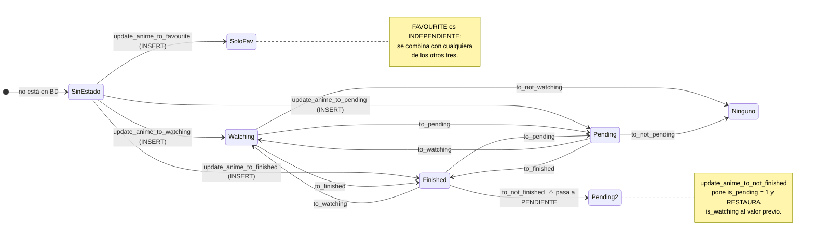

# 04 — Modelo de datos

| | |
|---|---|
| **Fecha** | 2026-07-28 · **Commit** `a972850` · árbol **sucio** |
| **Cubre** | `src/APIs/common/models.py`, `src/dataPersistence/animesPersistence.py`, `src/utils/db/sqlite.py` |

Procedencia: ✅ verificado en ejecución (sobre una **copia** de la BD real, 24 filas) · 📖 leído en
código · ⚠️ sin verificar.

---

## 1. `AnimeInfo` (red) vs `AnimeRecord` (BD)

**No son intercambiables.** `AnimeInfo` es lo que devuelve un proveedor; `AnimeRecord` es una fila de
`ANIMES`. Confundirlos es el error más frecuente en este repo.

| `AnimeInfo` (`models.py:86-93`) | `AnimeRecord` (`animesPersistence.py:61-81`) | Trampa |
|---|---|---|
| `id: Union[str,int]` | **`anime_id: str`** | ⚠️ **nombres distintos** |
| — | `id: Optional[int]` = **PK autoincremental** | ⚠️ `AnimeInfo.id` ≠ `AnimeRecord.id` |
| `title: str` | `title: str` | |
| **`poster: str`** | **`poster_url: str`** | ⚠️ nombres distintos |
| `synopsis: Optional[str]` | `synopsis: Optional[str]` | |
| `genres: Optional[List[str]]` | `genres: List[str]` (default `[]`) | `None` vs `[]` |
| **`episodes: Optional[List[EpisodeInfo]]`** | **`episodes: List[int]`** | ⚠️ **objetos vs enteros** |
| — | `watched_episodes: Set[int]` | solo en BD |
| — | `last_watched_episode: int` | solo en BD |
| — | `is_favourite/is_watching/is_finished/is_pending: bool` | solo en BD |

### Cheatsheet

```python
anime_info.id          ==  anime_record.anime_id     # el slug: "one-piece"
anime_info.poster      ==  anime_record.poster_url   # la URL
[e.id for e in anime_info.episodes]  ~=  anime_record.episodes   # ¡pero ver §4!
anime_record.id        # PK de SQLite — NO existe en AnimeInfo
```

### Conversión

| Dirección | Método | Línea |
|---|---|---|
| `AnimeInfo` → `AnimeRecord` | `AnimeRecord.from_anime_info(info, is_*=...)` | `:151-172` |
| fila BD → `AnimeRecord` | `AnimeRecord.from_db_dict(dict)` | `:109-146` |
| `AnimeRecord` → dict para INSERT | `record.to_db_dict()` | `:86-104` |
| `AnimeRecord` → `AnimeInfo` | **no existe** ⚠️ | — |

> ⚠️ **No hay conversión de vuelta.** Por eso las vistas de favoritos/finalizados/viendo/pendientes,
> que tienen `AnimeRecord`, hacen una petición de red (`get_anime_info`) al hacer clic en un anime en
> vez de reutilizar lo que ya tienen en BD (`favouriteAnimes.py:131`).

---

## 2. `AnimeField` → `FIELDS` / `FIELD_TYPES`

📖 `animesPersistence.py:28-55` y `:210-212`.

```python
class AnimeField(Enum):
    ID = ("id", "INTEGER")          # value = (columna, tipo SQLite)
    ...
    @property
    def column(self)   -> str: return self.value[0]
    @property
    def sql_type(self) -> str: return self.value[1]

FIELDS      = [f.column   for f in AnimeField]   # :210
FIELD_TYPES = [f.sql_type for f in AnimeField]   # :211
PRIMARY_KEY = "id AUTOINCREMENT"                 # :212
```

**Añadir una columna = añadir un miembro al enum.** Nada más… en una BD *nueva*. Ver §3.

| Miembro | Columna | Tipo declarado hoy |
|---|---|---|
| `ID` | `id` | `INTEGER` (PK autoincremental) |
| `ANIME_ID` | `anime_id` | `VARCHAR(100)` |
| `TITLE` | `title` | `VARCHAR(100)` |
| `POSTER_URL` | `poster_url` | `VARCHAR(200)` |
| `SYNOPSIS` | `synopsis` | `TEXT` |
| `GENRES` | `genres` | `JSON` |
| `EPISODES` | `episodes` | `JSON` |
| `WATCHED_EPISODES` | `watched_episodes` | `JSON` |
| `LAST_WATCHED_EPISODE` | `last_watched_episode` | `INTEGER` |
| `IS_FAVOURITE` | `is_favourite` | `BOOLEAN` |
| `IS_WATCHING` | `is_watching` | `BOOLEAN` |
| `IS_FINISHED` | `is_finished` | `BOOLEAN` |
| `IS_PENDING` | `is_pending` | `BOOLEAN` |

> ⚠️ **El orden de `AnimeField` debe coincidir con el de las columnas físicas.** Todas las consultas
> son `SELECT *` y `SqlUtils.query_sql` (`sqlite.py:57-63`) empareja `fila[i] → FIELDS[i]` **por
> posición**. Si se descuadra, los valores acaban en la clave equivocada **sin error alguno**.
> ✅ Hoy coinciden.

---

## 3. Esquema **real** de la tabla `ANIMES`

✅ Extraído con `PRAGMA table_info` de una copia de la BD del usuario:

```sql
CREATE TABLE ANIMES (
  id INTEGER, anime_id INTEGER, title VARCHAR(100), poster_url VARCHAR(100),
  synopsis TEXT, genres JSON, episodes JSON, watched_episodes JSON,
  last_watched_episode INTEGER, is_favourite BOOLEAN, is_watching BOOLEAN,
  is_finished BOOLEAN, is_pending BOOLEAN,
  PRIMARY KEY (id AUTOINCREMENT)
)
```

> ⚠️ El `CREATE TABLE` de arriba es el que tenía la BD del usuario **antes** de la migración de
> 2026-07-30. `validate_db_integrity()` reconstruye la tabla en el primer arranque posterior, dejando
> `anime_id VARCHAR(100)`. El resto de columnas y el orden no cambian.

### Discrepancias BD real ↔ `AnimeField`, y cómo se resuelven

| Columna | En la BD real (pre-migración) | En `AnimeField` | Veredicto |
|---|---|---|---|
| `anime_id` | **`INTEGER`** | `VARCHAR(100)` | Afinidad distinta (INTEGER vs TEXT) → **se reconstruye la tabla** |
| `poster_url` | **`VARCHAR(100)`** | `VARCHAR(200)` | Misma afinidad TEXT → **se ignora**, es cosmético |

✅ La divergencia de `anime_id` **no causó daño** gracias al tipado dinámico de SQLite: los 24
`anime_id` almacenados tenían `typeof(anime_id) = 'text'` aunque la columna se declarase `INTEGER`.
El riesgo era a futuro: un slug puramente numérico se habría guardado como entero y
`WHERE anime_id = ?` con un `str` habría dejado de encontrarlo.

### Política de migraciones ✅

Desde 2026-07-30 el esquema declarado es `AnimesPersistence.SCHEMA` (lista de `TableSchema`, derivada
de `AnimeField` para la tabla `ANIMES`) y `start()` llama a `validate_db_integrity()` en todo arranque.

| Escenario | Qué ocurre |
|---|---|
| BD nueva (fichero ausente) | Se crean **todas** las tablas de `SCHEMA` ✅ |
| BD existente + miembro nuevo al final del enum | `ALTER TABLE … ADD COLUMN`, sin mover datos ✅ |
| BD existente + miembro nuevo **en medio** del enum | Reconstrucción: el orden físico se realinea con el declarado, copiando por nombre de columna ✅ |
| BD existente + tipo cambiado (afinidad distinta) | Reconstrucción ✅ |
| BD existente + tipo cambiado (misma afinidad) | Se ignora, no se toca la BD ✅ |
| `TableSchema` nuevo añadido a `SCHEMA` | `CREATE TABLE` sobre la BD existente ✅ |
| Columna en BD **no declarada** en `SCHEMA` | Se descarta en la reconstrucción, con aviso por consola; queda en la copia de seguridad ⚠️ |

La comparación de tipos es **por afinidad SQLite** (`sqlite_affinity()` en `utils/db/sqlite.py`), no
por texto literal. Antes de la primera modificación se copia el `.db` a
`resources/DB/backups/DB_Animes_<timestamp>.db`. El proceso es idempotente: sin diferencias no toca la
BD ni crea copias.

**Receta al añadir una columna** → [11 §2](11-playbooks.md).

---

## 4. Serializaciones

### `genres` → JSON plano

📖 `:96`. `json.dumps(self.genres)` → `["accion", "aventura"]` ✅ verificado en BD.
Las consultas por género usan `LIKE '%"accion"%'` (`:278-280`) — de ahí que las comillas del JSON
importen.

### `episodes` → JSON **invertido**

📖 `to_db_dict:88` → `list(reversed(self.episodes))`. `update_anime_episodes:331` → `[::-1]`.
`from_db_dict` **no** deshace la inversión.

✅ **Round-trip verificado — NO conserva el orden:**

| Entrada | RAW en BD | Leído por `from_db_dict` |
|---|---|---|
| `[1,2,…,10]` (ascendente) | `[10,9,…,1]` | `[10,9,…,1]` |
| `[1,2,3,4,5]` vía `update_anime_episodes` | `[5,4,3,2,1]` | `[5,4,3,2,1]` |

⚠️ **Esto interactúa con el proveedor.** ✅ Verificado:

| Proveedor | Orden de `get_anime_info().episodes` | Tras guardar en BD |
|---|---|---|
| **AnimeAV1** | **ascendente** 1…1171 (`animeav1.py:227`) | descendente |
| **AnimeFLV** | **descendente** 1167…1 (`animeflv.py:222-223`) | ascendente |

Es decir: **el orden en BD depende de qué proveedor sirvió el dato**. La inversión solo tiene sentido
histórico para AnimeFLV. Trampa 4.

### `watched_episodes` → JSON de **rangos comprimidos**

📖 `_episodes_to_ranges:177-192` / `_ranges_to_episodes:194-201`.

✅ Round-trip verificado con conjunto discontinuo:

| Conjunto en memoria | RAW en BD | `last_watched_episode` |
|---|---|---|
| `{1, 2, 3, 5, 9}` | `[[1, 3], [5, 5], [9, 9]]` | `9` |
| `set()` | `[]` | `0` |
| (real del usuario, `one-piece-tv`) | `[[1, 1158]]` | `1158` |

**Nunca escribas este campo a mano.** Un elemento con longitud ≠ 2 se descarta en silencio
(`:199-200`), y `last_watched_episode` siempre se recalcula como `max(watched)` (`:319`).

---

## 5. Máquina de estados

📖 `AnimeStatus` (`:21-25`) — el **valor** del enum es el nombre de la columna, y se interpola
directamente en el SQL (`:406`, `:421`).



**Invariante**: `is_watching`, `is_finished` e `is_pending` son **mutuamente excluyentes**; activar
uno pone los otros dos a 0 (`_set_status:457-485`). `is_favourite` es ortogonal.

✅ Verificado en la BD real del usuario: **0 filas** con más de uno de los tres activos
(`SELECT COUNT(*) … WHERE (is_watching+is_finished+is_pending) > 1` → `0`).
Reparto real: 13 favoritos, 2 viendo, 13 finalizados, 6 pendientes sobre 24 filas.

Tabla de transiciones completa con líneas → [03 §5](03-flujos-de-ejecucion.md).

---

## 6. Valores de retorno: cuándo `False` significa algo

✅ Verificado. Esto **contradice a `CLAUDE.md`**, que afirma que los updates devuelven `False` si el
anime no está en BD:

| Método | Anime inexistente | Por qué |
|---|---|---|
| `update_watched_episodes` | **`False`** ✅ | comprueba explícitamente (`:314-315`) |
| `update_anime_to_not_watching` | **`False`** ✅ | comprueba (`:359-361`) |
| `update_anime_to_not_finished` | **`False`** ✅ | comprueba (`:379-381`) |
| `update_anime_episodes` | **`True`** ⚠️ | `UPDATE` puro; `update_sql` no mira `rowcount` |
| `update_anime_to_not_favourite` | **`True`** ⚠️ | `_update_flag`, `UPDATE` puro |
| `update_anime_to_not_pending` | **`True`** ⚠️ | ídem |

**Regla**: `True` de esta capa significa «el SQL se ejecutó sin excepción», **no** «se modificó una
fila». `SqlUtils.update_sql` (`sqlite.py:32-46`) nunca consulta `cursor.rowcount`.

---

## 7. Consultas por género y orden

📖 `get_anime_by_genre_and_order(status, genres, order)` (`:266-302`).

```sql
-- con géneros (:278-284)
SELECT * FROM ANIMES
WHERE ((genres LIKE '%"accion"%' OR genres LIKE '%"aventura"%') AND is_favourite = 1)
-- sin géneros (:286)
SELECT * FROM ANIMES WHERE is_favourite = 1
```

Si hay géneros **y** el orden es `AnimeOrderFilter.POR_DEFECTO`, ordena por número de géneros
coincidentes, descendente (`:294-302`).

> ✅ **Bug verificado**: el único llamante, `AccordionFilterButton.__apply_filters`
> (`utilsButtons.py:187`), pasa `self.selected_order.get()`, que es un **`str`** (`"default"`). La
> comparación `order != AnimeOrderFilter.POR_DEFECTO` (`:294`) es entonces **siempre `True`** → *return*
> en `:295` → **la ordenación por coincidencias nunca se aplica desde la GUI**. Con el enum sí
> funciona. Trampa 6.

⚠️ El `LIKE` no está parametrizado (`:279`): los valores se interpolan en el SQL. Hoy es seguro
porque solo pueden venir de `AnimeGenreFilter`, pero no aceptes ahí texto libre.
