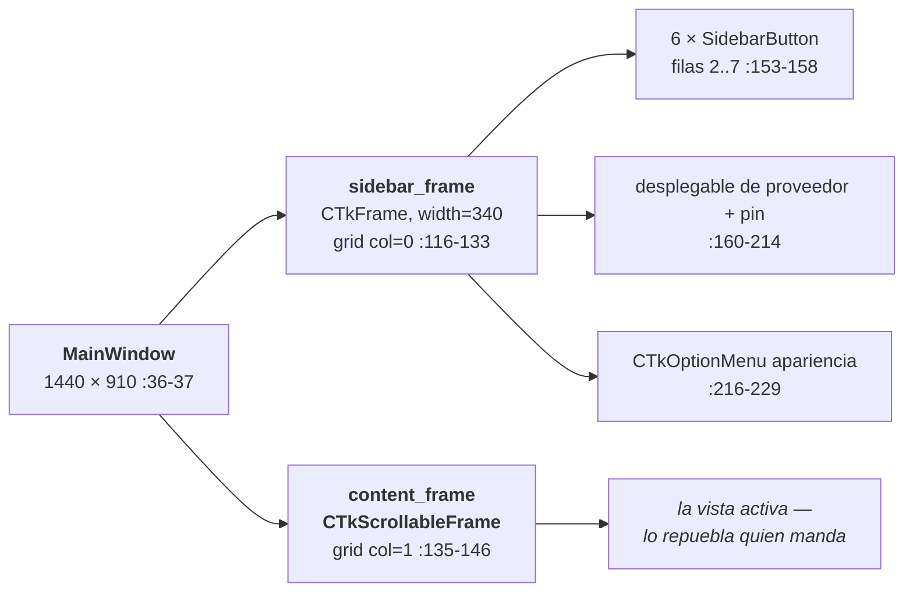
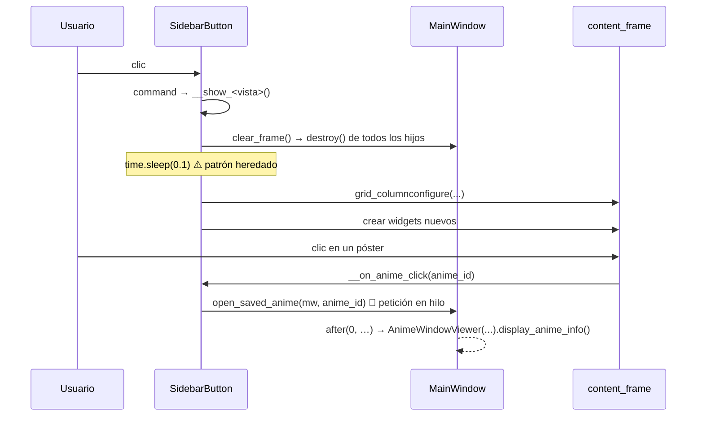

# 06 — GUI y vistas

| | |
|---|---|
| **Fecha** | 2026-08-16 · **Commit** `a3d4331` (2026-08-17, rama `main`) · árbol **limpio** |
| **Última revisión** | 2026-08-16 (**columna `provider_id`**): las 4 vistas de estado pasan a **3 filas de grid** por fila visual y a buscador **local**; la ficha gana el bloque de proveedor de hasta 3 líneas (§4) y `open_saved_anime()` unifica el clic (§3). `anime_window.py` crece de 647 a 1156 líneas |
| **Cubre** | `src/gui/main_window.py`, `src/gui/anime_window.py`, `src/gui/sidebarButtons/**`, `src/utils/buttons/utilsButtons.py` |

Procedencia: ✅ verificado en ejecución (arranque real de la GUI) · 📖 leído en código · ⚠️ sin verificar.

---

## 1. `MainWindow` como hub

📖 `main_window.py:35-93`. `MainWindow(ctk.CTk)` es la ventana raíz **y** el contenedor de todo el
estado compartido. **No hay router ni gestor de vistas**: cada vista recibe `main_window` y muta ese
estado directamente.



**`content_frame` es UNO SOLO.** Todas las vistas lo vacían con `clear_frame()` (`:118-120`) y lo
repueblan. No se crean frames por vista a nivel de ventana.

### Estado compartido: quién lo lee y quién lo muta

📖 `main_window.py:44-93`.

| Atributo | Tipo | Lo escribe | Lo lee |
|---|---|---|---|
| `animes_persistence` | `AnimesPersistence` | `__init__:44` | todas las vistas, `anime_window` |
| `anime_provider_mgr` | `AnimeProviderManager` | `__init__:45-49` | todas las vistas, `anime_window` |
| `recent_animes` | `List[AnimeRecord\|AnimeInfo]` | `download_images_and_show_animes:484` 🧵, `__preload_recent_animes_info:502-528` 🧵, `__on_recent_animes_reloaded:423` 🖥️ | `recentAnimes.py:45,55,83` |
| `favourite_animes` | `List[AnimeRecord]` | `load_animes:532` 🧵 | ⚠️ **nadie**: `favouriteAnimes.py:75` reconsulta la BD |
| `finished_animes` | `List[AnimeRecord]` | `load_animes:535` 🧵 | ⚠️ ídem (`finishedAnimes.py:75`) |
| `watching_animes` | `List[AnimeRecord]` | `load_animes:538` 🧵 | ⚠️ ídem (`watchingAnimes.py:77`) |
| `pending_animes` | `List[AnimeRecord]` | `load_animes:541` 🧵 | ⚠️ ídem (`pendingAnimes.py:77`) |
| `last_search_instance` | `AnimeSearch \| None` | `searchAnimes.py:55` | `searchAnimes.py:148-156` |
| `images_path` | `str` | `__init__:93` | `recentAnimes.py:61` |
| `sidebar_frame` / `content_frame` | widgets | `__config_main_frames:113-116` | todo el mundo |

> ⚠️ **Las cuatro listas cacheadas de estado están muertas.** ✅ Se rellenan en el arranque
> (`load_animes:530-543`) pero **ninguna vista las consume**: cada una vuelve a consultar la BD al
> pintarse. Es coste de arranque sin beneficio, y una fuente de confusión. Ver
> [12](12-deuda-tecnica-y-roadmap.md).

### Composition root

📖 `:47-49` es el **único** sitio de `gui/` donde se nombra un proveedor concreto. **El orden de
registro es el orden del fallback**:

```python
self.anime_provider_mgr.register(AnimeAV1Singleton(), default=True)
self.anime_provider_mgr.register(JKAnimeSingleton())     # 2026-08-06
self.anime_provider_mgr.register(AnimeFLVSingleton())
```

> ⚠️ **Corrección (2026-08-07)**: este bloque omitía `JKAnimeSingleton`, registrado el 2026-08-06.
> Son **tres** proveedores, y JKAnime va en medio a propósito ([01 §2](01-arquitectura.md)).

---

## 2. Ciclo de vida de una vista



> 🆕 **Desde el 2026-08-16 el último paso NO ocurre en el hilo de Tkinter por accidente.** La petición
> va en un hilo daemon y el repintado vuelve con `after(0, …)`. No es formalidad:
> `display_anime_info()` empieza destruyendo los widgets de la vista anterior y, hecho desde otro
> hilo, revienta con `invalid command name ...!searchbutton.!ctkcanvas` en cuanto la vista destruida
> tenía un `<Configure>` encolado — la barra de búsqueda de las cuatro vistas de estado. Ver
> [07](07-concurrencia-e-hilos.md).

**No hay `destroy()` de la vista anterior más allá de sus widgets.** El objeto `SidebarButton` vive
toda la sesión (se instancia una vez en `load_sidebar_buttons`), así que **su estado interno
persiste** entre visitas: `__episodes_frame`, `genre_vars`, `selected_order`, `__loading_frame`…
De ahí los `winfo_exists()` defensivos (`favouriteAnimes.py:93` y homólogos).

---

## 3. El patrón `SidebarButton`

📖 `utilsButtons.py:211-237`.

```python
class SidebarButton(BaseButton):
    def __init__(self, parent_frame, text, row, column, command,
                 icon_path_light, icon_path_dark):
        self.icon_light = load_image(icon_path_light, image_size=(24, 24))
        self.icon_dark  = load_image(icon_path_dark,  image_size=(24, 24))
        current_icon = self.icon_dark if ctk.get_appearance_mode() == "Dark" else self.icon_light
        super().__init__(parent_frame, text=" " + text, ...,
                         text_color="black", hover_color="white", corner_radius=0)
        self.grid(row=row, column=column, sticky="nsew")

    def update_icon(self, mode): ...     # :232-234
    def show_frame(self):                 # :236-237
        raise NotImplementedError("Subclasses must implement this method")
```

### Contrato de una vista

Una vista concreta debe:

1. Heredar de `utilsButtons.SidebarButton`.
2. En `__init__`: resolver los iconos, llamar a `super().__init__(main_window.sidebar_frame, TEXTO,
   row, column, self.__show_<vista>, icon_light, icon_dark)` y guardar `self.main_window`.
3. Implementar **`show_frame()`** — lo llama `MainWindow` en el arranque; es el punto de entrada
   programático.
4. Implementar `__show_<vista>()` — es el `command` del botón.
5. Registrarse en `MainWindow.load_sidebar_buttons()` (`main_window.py:154-238`).

Plantilla copiable → [08 §7](08-convenciones-y-estilo.md). Receta completa → [11 §1](11-playbooks.md).

### Las 6 vistas registradas

📖 `main_window.py:159-164`. Se instancian en filas 2 a 7, columna 0.

| Fila | Clase | Texto | Icono | `show_frame()` llama a |
|---|---|---|---|---|
| 2 | `RecentAnimeButton` | `ANIMES RECIENTES` | `recientes.png` | `__show_animes_recientes` |
| 3 | `FavouritesButton` | `ANIMES FAVORITOS` | `favoritos.png` | `__show_favorites` |
| 4 | `FinishedAnimeButton` | `ANIMES FINALIZADOS` | `finalizados.png` | `show_finished_animes` |
| 5 | `WatchingAnimeButton` | `ANIMES VIENDO` | `viendo.png` | `show_watching_animes` |
| 6 | `PendingAnimeButton` | `ANIMES PENDIENTES` | `pendientes.png` | `show_pending_animes` |
| 7 | `SearchButton` | `BUSCADOR DE ANIMES` | `buscar.png` | `__show_buscador` |

⚠️ Inconsistencia de nomenclatura: tres vistas usan método **privado** (`__show_*`) y tres
**público** (`show_*`). No hay razón funcional.

### Las 4 vistas «de estado» son casi idénticas

📖 `favouriteAnimes.py`, `finishedAnimes.py`, `watchingAnimes.py`, `pendingAnimes.py` comparten
estructura línea por línea. Diferencias reales:

| | `AnimeStatus` | Carpeta de pósters | Placeholder del buscador |
|---|---|---|---|
| favoritos | `FAVOURITE` | `favourite` | «Buscar mi anime favorito...» |
| finalizados | `FINISHED` | `finished` | «Buscar entre mis animes terminados...» |
| viendo | `WATCHING` | `watching` | «Buscar entre los animes que estoy viendo...» |
| pendientes | `PENDING` | `pending` | «Buscar entre mis animes pendientes...» |

Cada una: `__show_browser()` monta buscador + `AccordionFilterButton` + `__display_animes(...)`;
`__search_anime()` delega en un `SavedAnimeSearch`; `__display_animes()` pinta la rejilla;
`__on_anime_click()` delega en `open_saved_anime()`.

**🆕 `__on_anime_click` es hoy una sola línea en las cuatro** (2026-08-16). Antes cada vista repetía la
petición, la guarda del `None` y la construcción del viewer; ahora todo eso vive en
`open_saved_anime()`, que además elige el proveedor y saca la petición del hilo de Tkinter:

```python
def __on_anime_click(self, anime_id: Union[str, int]):
    # Es un anime de la biblioteca: el proveedor sale de su fila y la petición
    # va en un hilo aparte. Ambas cosas viven en open_saved_anime() porque las
    # cuatro vistas de estado hacen exactamente esto mismo.
    open_saved_anime(self.main_window, anime_id)
```

⚠️ **`searchAnimes.py` NO usa `open_saved_anime()`**, y es correcto: un resultado de búsqueda no tiene
por qué estar en la biblioteca, y ahí el proveedor no se decide —ya se sabe, es el que sirvió la
búsqueda—. Lo que sí copió es sacar la petición del hilo de Tkinter (`searchAnimes.py:344-382`).

La carpeta de pósters de la columna 3 debe estar además en `get_anime_image` (`utils.py:185-196`); a
`watching` se le olvidó durante meses ([11 §1](11-playbooks.md)).

### 🆕 La rejilla pasa a **3 filas de grid** por fila visual *(2026-08-16)*

Cada anime de las 4 vistas de estado muestra ahora **de qué sitio salió**, debajo del título:

```python
img_label.grid(row=row * 3,       column=column, ...)   # póster
title_label.grid(row=(row*3) + 1, column=column, ...)   # título
provider_label.grid(row=(row*3)+2, column=column, ...)  # proveedor, gris, 11 px
```

Sirve para ver de un vistazo cuáles **no** vienen del proveedor habitual: son los que pueden tardar
más en abrirse, o dejar de funcionar si ese sitio cae. Si la fila no tiene proveedor anotado, la
etiqueta va **vacía** en vez de decir «desconocido»: llenar la rejilla de ruido para informar de una
ausencia no compensa.

⚠️ Las otras dos vistas (recientes y buscador) siguen con **2 filas** por fila visual, porque sus
animes no son filas de la biblioteca. Al copiar código de una a otra, el multiplicador se escapa
fácil.

> 🆕 **El buscador de estas cuatro vistas se reescribió entero**. Antes hacía
> `search_animes_by_query` **contra el proveedor** y descartaba lo que no estuviera en BD con ese
> flag, cruzando **por slug** — así que sin conexión no encontraba nada, y con conexión perdía animes
> según qué proveedor tuvieras puesto. Es la [trampa 26](10-invariantes-y-trampas.md). Hoy la
> búsqueda local es la primaria y la web solo **suma**: ver `SavedAnimeSearch` en §7.

---

## 4. Jerarquía de widgets y convenciones de layout

### Rejilla de pósters (las 6 vistas)

📖 Idéntico en `recentAnimes.py:39,55-80`, `favouriteAnimes.py:100-136`, `searchAnimes.py:239-263`…

```python
num_columns = max(1, self.main_window.content_frame.winfo_width() // 150)
row    = index // num_columns
column = index %  num_columns
img_label.grid(row=row * 2,       column=column, padx=10, pady=(20, 0), sticky=NSEW)
title_label.grid(row=(row*2) + 1, column=column, padx=10, pady=(5, 10),  sticky=N)
```

- **Dos filas de grid por fila visual**: par = póster, impar = título.
- `wraplength=120` en el título; póster a `(130, 185)`.
- ⚠️ `winfo_width()` devuelve **1** si el widget aún no se ha dibujado, así que `num_columns` puede
  colapsar a 1 columna en el primer pintado. Es la razón del `time.sleep(0.1)` heredado
  ([07 §5](07-concurrencia-e-hilos.md)).

### Filas reservadas en `content_frame`

📖 Convención implícita, no documentada en el código:

| Fila | Contenido en las vistas de lista | Contenido en la ficha de detalle |
|---|---|---|
| 0 | buscador | **bloque de proveedor** (1-3 líneas) + póster (`rowspan=4`) |
| 1-2 | filtros de género | título · sinopsis |
| 3 | — | géneros |
| 4 | — | frame de estados (los 4 botones) |
| 5 | rejilla de resultados | lista de episodios |
| 6 | paginación / frame de carga | — |

Si añades una vista, **respeta estas filas** o el layout se solapará con el de otras vistas que
compartan `content_frame`.

> ⚠️ Las filas de la ficha **se desplazaron una posición el 2026-07-30** al introducir el selector de
> proveedor: estados 3 → 4, episodios 4 → 5. Si encuentras una cita `anime_window.py:<línea>` que
> hable de la fila 3 o 4, es anterior a ese cambio.

### La ficha de detalle

📖 Columnas con pesos `1 / 4 / 1 / 1`; la sinopsis y los géneros usan
`wraplength = content_frame.winfo_width() - 275`.

⚠️ **Ese `wraplength` calculado a mano es una trampa de layout**: cualquier widget nuevo que reserve
ancho en las columnas 1-3 recorta el texto de la sinopsis por la derecha, porque el `wraplength` se
fija sobre el ancho del `content_frame` entero y no sobre el de la celda. Por eso el bloque de
proveedor ocupa **su propia fila** (`row=0, column=1, columnspan=3, sticky=E`) en vez de compartir la
fila del título: al abarcar las tres columnas no obliga a ninguna a reservar ancho. Ver
[trampa 22](10-invariantes-y-trampas.md) y [13 §6](13-selector-de-proveedor.md).

> ✅ **Sigue aguantando tras crecer** (2026-08-16). Ese bloque pasó de una etiqueta a **hasta tres
> líneas** —proveedor, «En tu biblioteca» y el botón de actualizar— y la sinopsis no se recortó,
> porque todo lo nuevo va **dentro del mismo `provider_frame`**, apilado en sus filas 1 y 2. Lo que
> dispara la trampa no es el alto ni el ancho del widget, sino **en qué columnas del `content_frame`
> se declara**. Verificado por `test_fase6_gui.py`, que comprueba que el bloque sigue en
> `[row=0, column=1, columnspan=3]` y que el `wraplength` no cambia.

⚠️ `info_frame` fuerza `fg_color="white"` — **no se adapta al tema oscuro**.

### Elegir proveedor: el desplegable, el pin y la etiqueta

📖 Introducido el 2026-07-30 y **reformado el 2026-08-06** ([13](13-selector-de-proveedor.md)). Desde
esa reforma **solo hay un control**, el de la sidebar; la ficha se limita a informar.

| | Desplegable de la sidebar | **Pin**, a su lado | Etiqueta de la ficha |
|---|---|---|---|
| Qué hace | Cambia el proveedor **solo para esta sesión** | Fija (o desfija) el seleccionado como predeterminado | Nada: es informativa |
| ¿Persiste? | **No** | Sí, en `DB_user.db` | — |
| Fallback | **Activo** — si no, los animes guardados con el slug de otro proveedor dejarían de abrirse | — | — |
| Al pulsar | Recarga la lista de recientes y navega a esa vista | Solo cambia lo guardado; **no** cambia el proveedor en uso ni recarga nada | — |
| Qué muestra | El proveedor en uso | Azul = es tu predeterminado · gris = desviación temporal | **Quién sirvió realmente esta ficha** (hace visible el fallback) |

El desplegable se puebla **solo** desde `AnimeProviderManager.list_provider_infos()`: la GUI no
mantiene su propia lista de proveedores.

> 🗑️ **La ficha ya no permite cambiar de proveedor.** Tenía un desplegable propio con `strict=True`
> que re-resolvía el anime por título; se retiró porque, con la selección de la sidebar valiendo solo
> para la sesión, hacía lo mismo con más código. Lo que **sí** sigue: los servidores de vídeo se piden
> con `provider_id=self.provider_id, strict=True`, para que sean los del proveedor que sirvió **esa**
> ficha y no los de un fallback silencioso.

### 🆕 El bloque de proveedor de la ficha *(2026-08-16)*

📖 `__show_provider_label()` (`anime_window.py:434-511`). Un `CTkFrame` transparente en `row=0`, con
hasta **tres** líneas apiladas y alineadas a la derecha:

| Fila | Qué dice | Cuándo aparece |
|---|---|---|
| 0 | `Proveedor: <X>` | **siempre** — quién sirvió **estos datos** |
| 1 | `En tu biblioteca: <Y>` | si el anime está guardado — de quién es **tu fila** |
| 2 | botón `Actualizar a <Z>` | si hay algo que migrar (ver abajo) |

**La regla del ⚠, que es lo que más confunde**: el símbolo compara las **dos primeras líneas**.

| `Proveedor` vs `En tu biblioteca` | Aspecto |
|---|---|
| **Iguales** | gris `("gray45", "gray60")`, sin símbolo. Informativa: solo explica de dónde salió |
| **Distintos** | ⚠ + ámbar `("#B45309", "#FBBF24")` |

El ámbar señala una **identidad partida** ([trampa 21](10-invariantes-y-trampas.md)): lo que ves no lo
sirve el proveedor de tu fila, así que los botones de estado y el póster escriben en algo distinto de
lo que tienes delante. Pasa al desviarte en la sidebar, y también **sin tocar nada**, cuando entra el
fallback porque el dueño original ya no sirve ese anime — que es el único momento en que el fallback
se hace visible.

> ⚠️ **La línea 1 se muestra siempre que el anime esté guardado**, aunque no haya discrepancia.
> Mostrarla solo al detectar una hacía que el bloque contara **dos historias distintas**: con el
> proveedor de referencia seleccionado no hay desviación, la ficha la sirve el proveedor de la propia
> fila, no había discrepancia… y el botón de actualizar aparecía **sin nada que lo explicara**. Lo
> reportó el usuario. No lo vuelvas a condicionar.

**Cuándo se ofrece «Actualizar a …»** — 📖 `__repair_target_provider_id()` (`:528-554`):

| Situación | Destino | Coste |
|---|---|---|
| Identidad partida | **quien sirve la ficha** | 0 peticiones: ya está en pantalla |
| Sin partir, pero el proveedor **seleccionado** ≠ el de la fila | el seleccionado | 2 peticiones para localizar el anime allí → hilo + cursor `watch` |
| Sin partir y coincidiendo | — | no aparece |

> 🔴 **El segundo caso es el corriente y estuvo roto.** Atar el botón solo a la identidad partida lo
> dejaba fuera de alcance justo cuando más falta hace: al abrir un anime guardado sin desviar el
> desplegable lo sirve **el proveedor de su propia fila**, así que nunca había nada partido. El
> usuario solo consiguió verlo en un anime donde el fallback entraba por accidente.

Qué hace al confirmar: [04 §8](04-modelo-de-datos.md) (la escritura) y
[13 §14](13-selector-de-proveedor.md) (el porqué). El diálogo enumera lo que cambia y **cuántos
episodios vistos se conservan**, que es el dato por el que se decide.

> ⚠️ El pin **no es un `SidebarButton`**, así que `change_appearance_mode_event()` no lo recorre. Se
> adapta al tema porque usa `CTkImage(light_image=…, dark_image=…)`, que conmuta solo.

---

## 5. Temas claro/oscuro e iconos

📖 `main_window.py:156-157` fija `"System"` al arrancar. El cambio se gestiona en
`change_appearance_mode_event` (`:428-438`):

```python
ctk.set_appearance_mode(new_appearance_mode)
for widget in self.sidebar_frame.winfo_children():
    if isinstance(widget, SidebarButton):
        widget.configure(fg_color=..., hover_color=..., text_color=...)
        widget.update_icon(new_appearance_mode)
```

**Estado real de los iconos** ✅ (contenido de `resources/images/utils/`):

| Icono | Variante clara | Variante oscura | ¿Se usa? |
|---|---|---|---|
| `recientes.png` | — | — | mismo para ambos |
| `favoritos.png` / `no_favoritos.png` | — | — | mismo para ambos |
| `finalizados.png` | — | — | mismo para ambos |
| `viendo.png` | **`viendo_light.png`** | **`viendo_dark.png`** | ❌ **comentado** en `watchingAnimes.py:23-24` |
| `pendientes.png` | **`pendientes_light.png`** | **`pendientes_dark.png`** | ❌ **comentado** en `pendingAnimes.py:23-24` |
| `buscar.png` | — | — | mismo para ambos |

Los 4 PNG claro/oscuro **siguen en disco y sin trackear en git** (`?? resources/images/utils/…`),
comprobado el 2026-08-07. Activarlos es descomentar dos líneas por vista → [11 §5](11-playbooks.md).

> Contrasta con los 4 iconos del **pin** de proveedor (`{fijado,no_fijado}_{light,dark}.png`), que sí
> se commitearon en `ab5e75b` porque `main_window.py:200-209` los carga de verdad.

⚠️ **Deuda observada** 📖 (`utilsButtons.py:223`): el `text_color="black"` del constructor de
`SidebarButton` no se adapta al tema oscuro hasta que el usuario cambia manualmente la apariencia —
al arrancar en modo oscuro del sistema, el texto de la sidebar nace **negro sobre fondo oscuro**.
Solo lo corrige `MainWindow.change_appearance_mode_event` (`main_window.py:428-438`), que únicamente
se ejecuta al tocar el desplegable.

> ⚠️ **Corrección (2026-08-07)**: hasta hoy esto figuraba aquí y en [12 §2](12-deuda-tecnica-y-roadmap.md)
> como un «**TODO** abierto en `utilsButtons.py:56`». **No hay ningún `TODO` en ese fichero** — no lo
> tiene desde `d0fb393`. El defecto es real y sigue vivo; lo falso era atribuirlo a una nota del autor
> en una línea concreta.

---

## 6. `AnimeWindowViewer` — no es una ventana

📖 `anime_window.py:196-321`. Reemplaza el contenido de `content_frame`; **no crea un `Toplevel`**.
Por eso **no hay botón «volver»**: se vuelve pulsando otra vez en la sidebar.

Composición vertical:

1. **Bloque de proveedor** (`:434-511`) + póster `(195, 275)` + título + sinopsis + géneros
   (`:358-429`).
2. Frame de estados con los **4 botones** (`:711-770`), que se **redibuja entero** en cada cambio
   (`__display_anime_status:719-720` destruye y reconstruye).
3. Lista de episodios (`:905-981`): etiqueta, botón de orden, campo de búsqueda, y **los 25
   primeros** (`:916`).

**Detalles con consecuencias**:

- 📖 `[:25]` (`:916`) — el comentario dice «los 24 primeros» (`:955`); el código dice 25.
  ✅ Con AnimeAV1 (episodios **ascendentes**) verás los episodios **1-25**; con AnimeFLV
  (**descendentes**) los **25 más recientes**. Trampa 8.
- 📖 `__toggle_sort_order` (`:1004-1014`) ordena `self.anime_info.episodes` **in place**, mutando el
  objeto que también está en `main_window.recent_animes`.
- 📖 Cada estado se pinta con su icono; `pendientes.png` se carga en una variable llamada
  `watching_button_img` (`:758`) — copy-paste, funciona pero despista.
- ✅ `anime_info.episodes` ya **puede** llegar a `None`: `__with_episodes()` (`:297-307`) lo
  normaliza a `[]` **sobre una copia**. No se muta el original porque puede ser el objeto cacheado en
  `main_window.recent_animes`, donde ese `None` es justo lo que marca que le falta la precarga.

### 🆕 El constructor y las dos identidades

📖 `:232-295`. Cuatro parámetros, y el cuarto es el que evita duplicar filas:

```python
AnimeWindowViewer(main_window, anime_info, provider_id=None, anime_record=None)
```

| Parámetro | Si se omite |
|---|---|
| `provider_id` | cae a `anime_info.provider_id` (lo estampa el manager) y, en último caso, al predeterminado |
| `anime_record` | **se asume que `anime_info` es también lo guardado** |

Esa asunción es cierta al abrir desde recientes o desde una búsqueda, y **falsa** al abrir un anime de
la biblioteca con el desplegable desviado. Omitirlo ahí reintrodujo la trampa 21 durante la fase 4:
la ficha mostraba el anime como no guardado y un solo clic en un estado creaba una fila duplicada.

**Regla**: quien abra una ficha de algo que puede estar en la biblioteca pasa `anime_record=`.
Hoy solo lo hace `open_saved_anime()` (`:164-165`), y es el único que lo necesita.

### 🆕 `__confirm_save()` — el aviso de duplicado

📖 `:779-828`. Se ejecuta antes de los cuatro `add_to_*`. Consulta la BD en vez de mirar el estado
cacheado al pintar: si el usuario ya ha pulsado otro estado en esta misma pantalla, la fila existe
desde entonces y no hay nada que avisar.

Compara por **título normalizado** contra toda la biblioteca (`find_saved_duplicate`, `:69-105`), con
umbral **0.9** — muy por encima del 0.75-0.8 de las búsquedas, a propósito: aquí un falso positivo
interrumpe con un diálogo por dos animes distintos de la misma saga, mientras que un falso negativo
solo deja pasar el duplicado que ya se colaba antes.

El diálogo nombra **la sección concreta** («tu Biblioteca de Favoritos», `STATUS_SECTION_NAMES`) y
dice en cuáles está el duplicado, sacándolo de **sus propios flags** y no de la que se acaba de
pulsar: decir «ya está en Favoritos» cuando está en Pendientes sería mentir justo en el dato por el
que el usuario decide.

---

## 7. Widgets reutilizables

📖 `utilsButtons.py`.

| Clase / función | Línea | Uso |
|---|---|---|
| 🆕 `filter_animes_by_title()` | `:23-56` | búsqueda **local** en la biblioteca, sin red |
| 🆕 `match_animes_from_search()` | `:59-94` | traduce resultados web → filas guardadas |
| 🆕 `SavedAnimeSearch` | `:97-166` | el buscador de las 4 vistas de estado |
| `BaseButton` | `:168-176` | base de todos |
| `EpisodeButton` | `:178-189` | `anime_window.py:957` |
| `SearchButton` | `:191-199` | las 4 vistas de estado ⚠️ **homónimo** del `SearchButton` de la sidebar (`searchAnimes.py:35`) |
| `ApplyFiltersButton` | `:201-209` | `searchAnimes.py:142` |
| `SidebarButton` | `:211-237` | las 6 vistas |
| `AccordionFilterButton` | `:239-351` | las 4 vistas de estado |

### 🆕 `SavedAnimeSearch` — dos búsquedas que se suman

📖 `:97-166`. Las cuatro vistas de estado instancian una en su `__init__` y su `__search_anime()` se
limita a delegar. Resuelve dos cosas distintas, y por eso **se suman** en vez de elegir una:

| | Qué aporta | Coste |
|---|---|---|
| **Local** (`filter_animes_by_title`) | Compara con los títulos ya guardados, normalizados. **No depende del proveedor** y funciona sin conexión | 0 |
| **Web** (`search_animes_by_query`, `strict=True`) | Encuentra lo que un título guardado no puede saber: que «Solo Leveling» es «Ore dake Level Up na Ken» | 1 petición, en hilo |

Lo local se pinta **antes** de salir a la red; lo de la web se añade después, ya en el hilo de
Tkinter vía `after()`. Así el buscador responde al instante y **nunca quita** resultados: solo puede
añadirlos.

Tres detalles que hacen falta y no se ven:

- **`strict=True` en la web**: el usuario ha elegido un proveedor y es el que manda; que responda otro
  por fallback daría resultados que no ha pedido.
- **Contador de generación** (`:135`): escribir dos veces seguidas no puede dejar que la respuesta
  lenta de la primera pise el resultado de la segunda.
- **`is_still_visible`**: sin esa guarda, una búsqueda lenta repinta encima de la vista a la que ya
  has cambiado.

La coincidencia local es por **subcadena** sobre el título normalizado —así «One Piece» devuelve
también «One Piece Film: Red»— y, si no, por similitud ≥ `TITLE_SEARCH_THRESHOLD` (**0.8**), que solo
está para tolerar erratas («dandandan» → «Dandadan»). Ver [trampa 26](10-invariantes-y-trampas.md).

### `AccordionFilterButton`

📖 `:239-351`. Filtro plegable con los **40 géneros** en rejilla de 10 columnas (`:294-304`) y los
3 órdenes como radio buttons (`:306-324`).

- `toggle_content()` (`:263-269`) alterna «Abrir/Cerrar filtro de animes».
- ⚠️ `__collapse_content` (`:271-274`) hace `grid_forget()`, pero `__expand_content` (`:276-282`)
  **crea un `CTkFrame` nuevo cada vez** → al plegar y desplegar repetidamente se acumulan frames
  huérfanos.
- ✅ `__apply_filters` (`:336-348`) pasa un **`str`** donde se espera un enum → la ordenación por
  coincidencias de género nunca se aplica. Trampa 6, detalle en [04 §7](04-modelo-de-datos.md).
