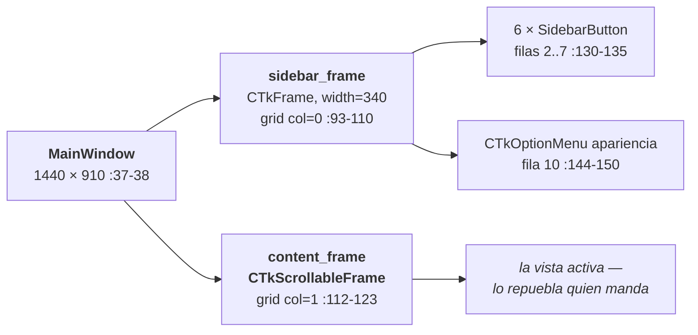
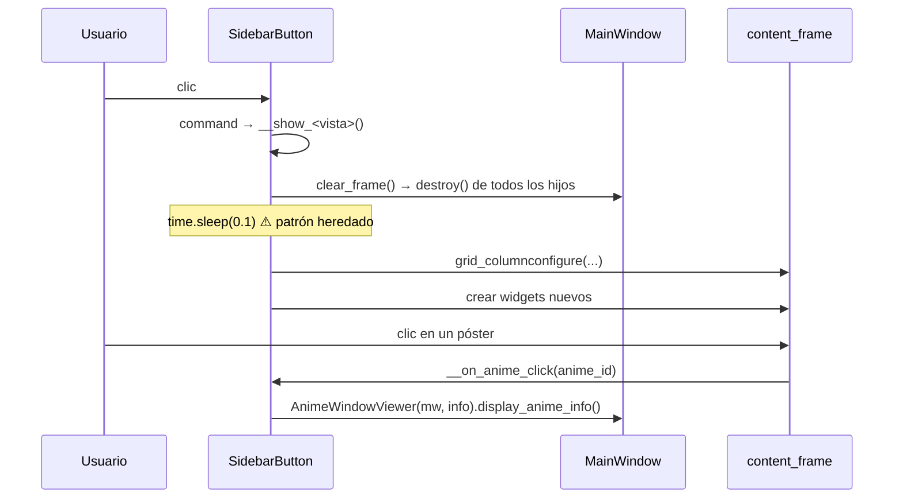

# 06 — GUI y vistas

| | |
|---|---|
| **Fecha** | 2026-07-28 · **Commit** `a972850` · árbol **sucio** |
| **Cubre** | `src/gui/main_window.py`, `src/gui/anime_window.py`, `src/gui/sidebarButtons/**`, `src/utils/buttons/utilsButtons.py` |

Procedencia: ✅ verificado en ejecución (arranque real de la GUI) · 📖 leído en código · ⚠️ sin verificar.

---

## 1. `MainWindow` como hub

📖 `main_window.py:36-69`. `MainWindow(ctk.CTk)` es la ventana raíz **y** el contenedor de todo el
estado compartido. **No hay router ni gestor de vistas**: cada vista recibe `main_window` y muta ese
estado directamente.



**`content_frame` es UNO SOLO.** Todas las vistas lo vacían con `clear_frame()` (`:89-91`) y lo
repueblan. No se crean frames por vista a nivel de ventana.

### Estado compartido: quién lo lee y quién lo muta

📖 `main_window.py:46-64`.

| Atributo | Tipo | Lo escribe | Lo lee |
|---|---|---|---|
| `animes_persistence` | `AnimesPersistence` | `__init__:46` | todas las vistas, `anime_window` |
| `anime_provider_mgr` | `AnimeProviderManager` | `__init__:47-49` | todas las vistas, `anime_window` |
| `recent_animes` | `List[AnimeRecord\|AnimeInfo]` | `download_images_and_show_animes:209` 🧵, `__preload_recent_animes_info:241` 🧵, `recentAnimes.py:93` 🧵 | `recentAnimes.py:45,55,83` |
| `favourite_animes` | `List[AnimeRecord]` | `load_animes:247` 🧵 | ⚠️ **nadie**: `favouriteAnimes.py:75` reconsulta la BD |
| `finished_animes` | `List[AnimeRecord]` | `load_animes:250` 🧵 | ⚠️ ídem (`finishedAnimes.py:75`) |
| `watching_animes` | `List[AnimeRecord]` | `load_animes:253` 🧵 | ⚠️ ídem (`watchingAnimes.py:77`) |
| `pending_animes` | `List[AnimeRecord]` | `load_animes:256` 🧵 | ⚠️ ídem (`pendingAnimes.py:77`) |
| `last_search_instance` | `AnimeSearch \| None` | `searchAnimes.py:55` | `searchAnimes.py:148-156` |
| `images_path` | `str` | `__init__:64` | `recentAnimes.py:61` |
| `sidebar_frame` / `content_frame` | widgets | `__config_main_frames:84-87` | todo el mundo |

> ⚠️ **Las cuatro listas cacheadas de estado están muertas.** ✅ Se rellenan en el arranque
> (`load_animes:245-258`) pero **ninguna vista las consume**: cada una vuelve a consultar la BD al
> pintarse. Es coste de arranque sin beneficio, y una fuente de confusión. Ver
> [12](12-deuda-tecnica-y-roadmap.md).

### Composition root

📖 `:48-49` es el **único** sitio de `gui/` donde se nombra un proveedor concreto:

```python
self.anime_provider_mgr.register(AnimeAV1Singleton(), default=True)
self.anime_provider_mgr.register(AnimeFLVSingleton())
```

---

## 2. Ciclo de vida de una vista



**No hay `destroy()` de la vista anterior más allá de sus widgets.** El objeto `SidebarButton` vive
toda la sesión (se instancia una vez en `load_sidebar_buttons`), así que **su estado interno
persiste** entre visitas: `__episodes_frame`, `genre_vars`, `selected_order`, `__loading_frame`…
De ahí los `winfo_exists()` defensivos (`favouriteAnimes.py:98` y homólogos).

---

## 3. El patrón `SidebarButton`

📖 `utilsButtons.py:57-83`.

```python
class SidebarButton(BaseButton):
    def __init__(self, parent_frame, text, row, column, command,
                 icon_path_light, icon_path_dark):
        self.icon_light = load_image(icon_path_light, image_size=(24, 24))
        self.icon_dark  = load_image(icon_path_dark,  image_size=(24, 24))
        current_icon = self.icon_dark if ctk.get_appearance_mode() == "Dark" else self.icon_light
        super().__init__(parent_frame, text=" " + text, ...,
                         text_color="black", hover_color="white", corner_radius=0)
        self.grid(row=row, column=column, sticky="nsew")

    def update_icon(self, mode): ...     # :78-80
    def show_frame(self):                 # :82-83
        raise NotImplementedError("Subclasses must implement this method")
```

### Contrato de una vista

Una vista concreta debe:

1. Heredar de `utilsButtons.SidebarButton`.
2. En `__init__`: resolver los iconos, llamar a `super().__init__(main_window.sidebar_frame, TEXTO,
   row, column, self.__show_<vista>, icon_light, icon_dark)` y guardar `self.main_window`.
3. Implementar **`show_frame()`** — lo llama `MainWindow` en el arranque; es el punto de entrada
   programático.
4. Implementar `__show_<vista>()` — es el `command` del botón.
5. Registrarse en `MainWindow.load_sidebar_buttons()` (`main_window.py:125-151`).

Plantilla copiable → [08 §7](08-convenciones-y-estilo.md). Receta completa → [11 §1](11-playbooks.md).

### Las 6 vistas registradas

📖 `main_window.py:130-135`. Se instancian en filas 2 a 7, columna 0.

| Fila | Clase | Texto | Icono | `show_frame()` llama a |
|---|---|---|---|---|
| 2 | `RecentAnimeButton` | `ANIMES RECIENTES` | `recientes.png` | `__show_animes_recientes` |
| 3 | `FavouritesButton` | `ANIMES FAVORITOS` | `favoritos.png` | `__show_favorites` |
| 4 | `FinishedAnimeButton` | `ANIMES FINALIZADOS` | `finalizados.png` | `show_finished_animes` |
| 5 | `WatchingAnimeButton` | `ANIMES VIENDO` | `viendo.png` | `show_watching_animes` |
| 6 | `PendingAnimeButton` | `ANIMES PENDIENTES` | `pendientes.png` | `show_pending_animes` |
| 7 | `SearchButton` | `BUSCADOR DE ANIMES` | `buscar.png` | `__show_buscador` |

⚠️ Inconsistencia de nomenclatura: tres vistas usan método **privado** (`__show_*`) y tres
**público** (`show_*`). No hay razón funcional.

### Las 4 vistas «de estado» son casi idénticas

📖 `favouriteAnimes.py`, `finishedAnimes.py`, `watchingAnimes.py`, `pendingAnimes.py` comparten
estructura línea por línea. Diferencias reales:

| | `AnimeStatus` | Carpeta de pósters | Placeholder del buscador |
|---|---|---|---|
| favoritos | `FAVOURITE` | `favourite` | «Buscar mi anime favorito...» |
| finalizados | `FINISHED` | `finished` | «Buscar entre mis animes terminados...» |
| viendo | `WATCHING` | `watching` | «Buscar entre los animes que estoy viendo...» |
| pendientes | `PENDING` | `pending` | «Buscar entre mis animes pendientes...» |

Cada una: `__show_browser()` monta buscador + `AccordionFilterButton` + `__display_animes(...)`;
`__search_anime()` consulta **la red** y filtra contra la BD por el flag correspondiente;
`__display_animes()` pinta la rejilla; `__on_anime_click()` pide `get_anime_info` y abre la ficha.

> ⚠️ **`__search_anime` funciona al revés de lo que uno espera**: en vez de buscar en la biblioteca
> local, hace `search_animes_by_query` **contra el proveedor** y luego descarta los resultados que no
> estén en BD con ese flag (`favouriteAnimes.py:82-95`). Sin conexión, el buscador local no encuentra
> nada.

---

## 4. Jerarquía de widgets y convenciones de layout

### Rejilla de pósters (las 6 vistas)

📖 Idéntico en `recentAnimes.py:39,55-80`, `favouriteAnimes.py:105-128`, `searchAnimes.py:239-263`…

```python
num_columns = max(1, self.main_window.content_frame.winfo_width() // 150)
row    = index // num_columns
column = index %  num_columns
img_label.grid(row=row * 2,       column=column, padx=10, pady=(20, 0), sticky=NSEW)
title_label.grid(row=(row*2) + 1, column=column, padx=10, pady=(5, 10),  sticky=N)
```

- **Dos filas de grid por fila visual**: par = póster, impar = título.
- `wraplength=120` en el título; póster a `(130, 185)`.
- ⚠️ `winfo_width()` devuelve **1** si el widget aún no se ha dibujado, así que `num_columns` puede
  colapsar a 1 columna en el primer pintado. Es la razón del `time.sleep(0.1)` heredado
  ([07 §5](07-concurrencia-e-hilos.md)).

### Filas reservadas en `content_frame`

📖 Convención implícita, no documentada en el código:

| Fila | Contenido | Dónde |
|---|---|---|
| 0 | buscador / póster de la ficha | `favouriteAnimes.py:42`, `anime_window.py:80` |
| 1-2 | filtros de género / sinopsis + géneros | `utilsButtons.py:106,128`, `anime_window.py:111,124` |
| 3 | frame de estados (los 4 botones) | `anime_window.py:130` |
| 4 | lista de episodios | `anime_window.py:254` |
| 5 | rejilla de resultados | `favouriteAnimes.py:103`, `searchAnimes.py:237` |
| 6 | paginación / frame de carga | `searchAnimes.py:179,270` |

Si añades una vista, **respeta estas filas** o el layout se solapará con el de otras vistas que
compartan `content_frame`.

### La ficha de detalle

📖 `anime_window.py:63-126`. Columnas con pesos `1 / 4 / 1 / 1` (`:70-73`); la sinopsis y los géneros
usan `wraplength = content_frame.winfo_width() - 275` (`:107`, `:120`).

⚠️ `info_frame` fuerza `fg_color="white"` (`:79`) — **no se adapta al tema oscuro**.

---

## 5. Temas claro/oscuro e iconos

📖 `main_window.py:150-151` fija `"System"` al arrancar. El cambio se gestiona en
`change_appearance_mode_event` (`:153-163`):

```python
ctk.set_appearance_mode(new_appearance_mode)
for widget in self.sidebar_frame.winfo_children():
    if isinstance(widget, SidebarButton):
        widget.configure(fg_color=..., hover_color=..., text_color=...)
        widget.update_icon(new_appearance_mode)
```

**Estado real de los iconos** ✅ (contenido de `resources/images/utils/`):

| Icono | Variante clara | Variante oscura | ¿Se usa? |
|---|---|---|---|
| `recientes.png` | — | — | mismo para ambos |
| `favoritos.png` / `no_favoritos.png` | — | — | mismo para ambos |
| `finalizados.png` | — | — | mismo para ambos |
| `viendo.png` | **`viendo_light.png`** | **`viendo_dark.png`** | ❌ **comentado** en `watchingAnimes.py:23-24` |
| `pendientes.png` | **`pendientes_light.png`** | **`pendientes_dark.png`** | ❌ **comentado** en `pendingAnimes.py:23-24` |
| `buscar.png` | — | — | mismo para ambos |

Los 4 PNG claro/oscuro **existen en disco pero están sin trackear en git** (`?? resources/images/utils/…`).
Activarlos es descomentar dos líneas por vista → [11 §5](11-playbooks.md).

⚠️ **TODO abierto** (`utilsButtons.py:56`): el `text_color="black"` del constructor (`:69`) no se
adapta al tema oscuro hasta que el usuario cambia manualmente la apariencia — al arrancar en modo
oscuro del sistema, el texto de la sidebar nace negro sobre fondo oscuro.

---

## 6. `AnimeWindowViewer` — no es una ventana

📖 `anime_window.py:27-40`. Reemplaza el contenido de `content_frame`; **no crea un `Toplevel`**.
Por eso **no hay botón «volver»**: se vuelve pulsando otra vez en la sidebar.

Composición vertical:

1. Póster `(195, 275)` + título + sinopsis + géneros (`:63-126`).
2. Frame de estados con los **4 botones** (`:128-187`), que se **redibuja entero** en cada cambio
   (`__display_anime_status:136-137` destruye y reconstruye).
3. Lista de episodios (`:252-328`): etiqueta, botón de orden, campo de búsqueda, y **los 25
   primeros** (`:263`).

**Detalles con consecuencias**:

- 📖 `[:25]` (`:263`) — el comentario dice «los 24 primeros» (`:302`); el código dice 25.
  ✅ Con AnimeAV1 (episodios **ascendentes**) verás los episodios **1-25**; con AnimeFLV
  (**descendentes**) los **25 más recientes**. Trampa 8.
- 📖 `__toggle_sort_order` (`:351-361`) ordena `self.anime_info.episodes` **in place**, mutando el
  objeto que también está en `main_window.recent_animes`.
- 📖 Cada estado se pinta con su icono; `pendientes.png` se carga en una variable llamada
  `watching_button_img` (`:175`) — copy-paste, funciona pero despista.
- ⚠️ `anime_info.episodes` **no puede ser `None`**: `:33` lo itera en el constructor.

---

## 7. Widgets reutilizables

📖 `utilsButtons.py`.

| Clase | Línea | Uso |
|---|---|---|
| `BaseButton` | `:14-21` | base de todos |
| `EpisodeButton` | `:24-34` | `anime_window.py:304` |
| `SearchButton` | `:37-44` | las 4 vistas de estado ⚠️ **homónimo** del `SearchButton` de la sidebar (`searchAnimes.py:34`) |
| `ApplyFiltersButton` | `:47-54` | `searchAnimes.py:142` |
| `SidebarButton` | `:57-83` | las 6 vistas |
| `AccordionFilterButton` | `:85-197` | las 4 vistas de estado |

### `AccordionFilterButton`

📖 `:85-197`. Filtro plegable con los **40 géneros** en rejilla de 10 columnas (`:140-148`) y los
3 órdenes como radio buttons (`:161-170`).

- `toggle_content()` (`:109-115`) alterna «Abrir/Cerrar filtro de animes».
- ⚠️ `__collapse_content` (`:117-120`) hace `grid_forget()`, pero `__expand_content` (`:122-128`)
  **crea un `CTkFrame` nuevo cada vez** → al plegar y desplegar repetidamente se acumulan frames
  huérfanos.
- ✅ `__apply_filters` (`:182-194`) pasa un **`str`** donde se espera un enum → la ordenación por
  coincidencias de género nunca se aplica. Trampa 6, detalle en [04 §7](04-modelo-de-datos.md).
