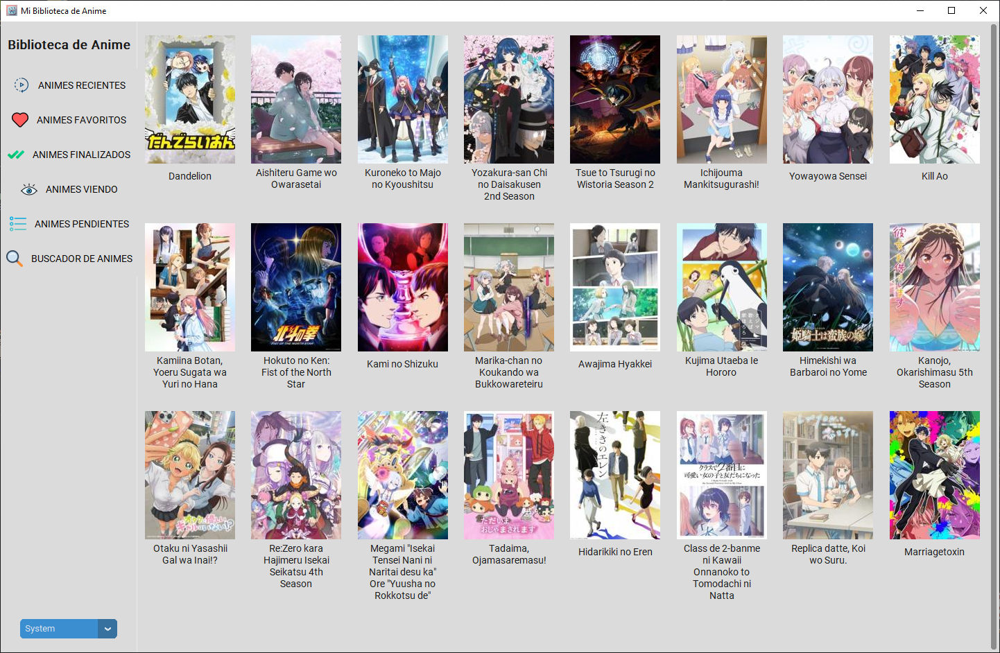
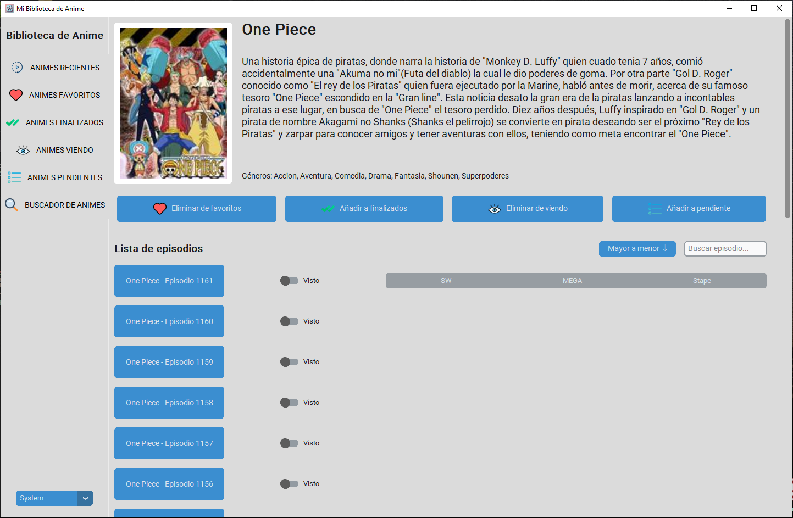

<div align="center">

# BibliotecaAnime

**Tu colección personal de anime, 100% offline, privada y sin dependencias web.**

[](https://www.python.org/)
[](https://opensource.org/licenses/gpl-3.0)
[](#)
[](#)

[Características](#caracteristicas-principales) • [Instalación](##instalación-y-despliegue) • [Estructura](#-estructura-del-proyecto) • [Próximos pasos](#-proximos-pasos)

</div>

---

## Sobre el Proyecto

**BibliotecaAnime** es una aplicación de escritorio nativa desarrollada en Python diseñada para gestionar tu catálogo de animes vistos, en seguimiento y pendientes.
A diferencia de plataformas como MyAnimeList o Anilist, este proyecto nace con una filosofía clara: **Privacidad, velocidad y control local**.

## Características Principales

- **100% Local y Privado:** Toda la base de datos y las imágenes (portadas) se almacenan localmente en tu equipo.
- **Rendimiento Nativo:** Sin latencia de red. Navegación instantánea por tu biblioteca.
- **Gestión Integral (CRUD):** Añade nuevos animes, actualiza episodios vistos, asigna calificaciones y categoriza por estados (*Viendo, Completado, Dropeado, Pendiente*).
- **Portable:** Posibilidad de compilar la aplicación en un único archivo ejecutable (`.exe`) para llevar tu librería en un pendrive a cualquier parte.

---

## Capturas de Pantalla

| Vista Principal | Detalles del Anime |
| :---: | :---: |
|  |  |

---

## Tecnologías Utilizadas

- **Lenguaje:** [Python 3](https://www.python.org/)
- **Interfaz Gráfica:** *CustomTkinter*.
- **Base de Datos:** SQLite3 (Nativo en Python).
- **Manejo de Imágenes:** [Pillow (PIL)](https://python-pillow.org/)
- **Empaquetado:** [PyInstaller](https://pyinstaller.org/)

---

## Instalación y Despliegue

### 1. Clonar el repositorio
```bash
git clone https://github.com/DavidEscri/BibliotecaAnime.git
```
```bash
cd BibliotecaAnime
```
### 2. Crear un Entorno Virtual (Ejemplo en Windows)
```bash
python -m venv venv
venv\Scripts\activate
```
### 3. Instalar Dependencias
```bash
pip install -r requirements.txt
```

### 4. Ejecutar en modo desarrollo
```bash
python src/app.py
```

## Compilar el Ejecutable (.exe)
El proyecto incluye un archivo de configuración .spec (MiBibliotecaAnime.spec) preparado para generar un ejecutable independiente para Windows.
Para compilar la aplicación y no depender de la consola de Python, ejecuta:
```bash
pyinstaller MiBibliotecaAnime.spec
```
*El archivo ejecutable final se generará automáticamente dentro de la carpeta dist/MiBibliotecaAnime_v<VERSION>/*

## Estructura del Proyecto
```
MiBibliotecaAnime/
├── src/
│   ├── app.py                          # Punto de entrada principal
│   ├── APIs/
│   │   └── animeflv/
│   │       └── animeflv.py             # Cliente web scraping de AnimeFLV
│   ├── dataPersistence/
│   │   └── animesPersistence.py        # Capa de acceso a datos (SQLite)
│   ├── gui/
│   │   ├── main_window.py              # Ventana principal (CTk)
│   │   ├── anime_window.py             # Vista de detalle de un anime
│   │   └── sidebarButtons/
│   │       ├── recentAnimes/           # Botón y vista: animes recientes
│   │       ├── favouriteAnimes/        # Botón y vista: favoritos
│   │       ├── finishedAnimes/         # Botón y vista: finalizados
│   │       ├── watchingAnimes/         # Botón y vista: viendo
│   │       ├── pendingAnimes/          # Botón y vista: pendientes
│   │       └── searchAnimes/           # Botón y vista: buscador
│   └── utils/
│       ├── utils.py                    # Helpers generales (imágenes, rutas, descarga)
│       ├── buttons/
│       │   └── utilsButtons.py         # Componentes de botones reutilizables
│       └── db/
│           └── sqlite.py               # Abstracción sobre sqlite3
├── resources/
│   ├── DB/
│   │   └── DB_Animes.db                # Base de datos SQLite (generada en tiempo de ejecución)
│   └── images/
│       ├── utils/                      # Iconos de la app (app_icon.ico, loading-image.gif, etc.)
│       ├── recent_animes/              # Posters en caché de animes recientes
│       ├── favourite/                  # Posters de animes favoritos
│       ├── finished/                   # Posters de animes finalizados
│       ├── watching/                   # Posters de animes en curso
│       ├── pending/                    # Posters de animes pendientes
│       └── search/                     # Posters temporales del buscador
├── MiBibliotecaAnime.spec              # Configuración de PyInstaller
└── requirements.txt
└── README.md                           # Documentación del proyecto
```

## Próximos Pasos
 - Integración con mas servicios de streaming online de anime como animeav1 o jkanime.
 - Integración con servicios de visualización de manga online.
 - Alternar entre visualización de anime y manga.
 - Capacidad de identificar el capitulo del manga por el que continuar tras finalizar un anime.
 - Mostrar animes/mangas relacionados que podrían gustar al usuario tras finalizar un anime/manga.
 - Mejora visual general.

## Contribuciones
Siendo un proyecto personal, las sugerencias y mejoras son siempre bienvenidas. Si deseas contribuir:
 1. Haz un Fork del proyecto.
 2. Crea una rama para tu función (git checkout -b feature/NuevaFuncion).
 3. Haz commit de tus cambios (git commit -m 'Añade NuevaFuncion').
 4. Haz push a la rama (git push origin feature/NuevaFuncion).
 5. Abre un Pull Request.
