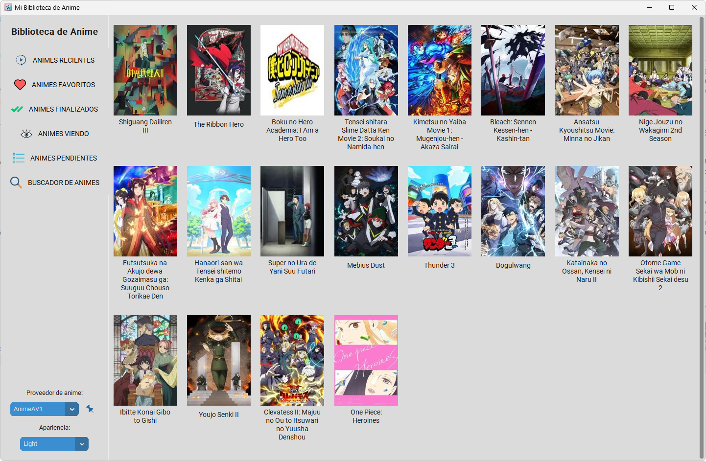
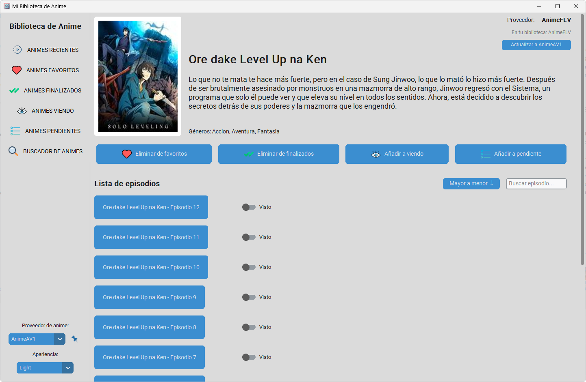

<div align="center">

# BibliotecaAnime

**Tu biblioteca de anime: tu colección vive solo en tu equipo; el catálogo llega de proveedores web públicos.**

[](https://www.python.org/)
[](LICENSE)
[](#)
[](#)

[Características](#caracteristicas-principales) • [Instalación](##instalación-y-despliegue) • [Estructura](#-estructura-del-proyecto) • [Próximos pasos](#-proximos-pasos) • [Licencia](#licencia)

</div>

---

## Sobre el Proyecto

**BibliotecaAnime** es una aplicación de escritorio nativa desarrollada en Python diseñada para gestionar tu catálogo de animes vistos, en seguimiento y pendientes.
A diferencia de plataformas como MyAnimeList o Anilist, este proyecto nace con una filosofía clara: **Privacidad, velocidad y control local**.

## Características Principales

- **Tu colección, solo en tu equipo:** La base de datos y las portadas se almacenan en local. Sin cuenta, sin registro y sin telemetría: la aplicación no tiene backend propio ni envía tus datos a ningún sitio.
- **Catálogo de varios proveedores:** Los datos de los animes (fichas, episodios y enlaces) se obtienen por *web scraping* de sitios públicos de anime, con selección de proveedor y sistema de reserva si uno falla. **Esta parte sí requiere conexión a internet.**
- **Rendimiento Nativo:** Una vez guardado un anime, navegar por tu biblioteca y buscar en ella es instantáneo y funciona sin conexión.
- **Gestión Integral (CRUD):** Añade nuevos animes, marca los episodios vistos y organízalos por estados (*Favoritos, Viendo, Finalizados, Pendientes*).
- **Portable:** Posibilidad de compilar la aplicación en un único archivo ejecutable (`.exe`) para llevar tu librería en un pendrive a cualquier parte.

---

## Capturas de Pantalla

|               Vista Principal               |               Detalles del Anime               |
|:-------------------------------------------:|:----------------------------------------------:|
|  |  |

---

## Tecnologías Utilizadas

- **Lenguaje:** [Python 3](https://www.python.org/)
- **Interfaz Gráfica:** *CustomTkinter*.
- **Base de Datos:** SQLite3 (Nativo en Python).
- **Manejo de Imágenes:** [Pillow (PIL)](https://python-pillow.org/)
- **Empaquetado:** [PyInstaller](https://pyinstaller.org/)

---

## Instalación y Despliegue

### 1. Clonar el repositorio
```bash
git clone https://github.com/DavidEscri/BibliotecaAnime.git
```
```bash
cd BibliotecaAnime
```
### 2. Crear un Entorno Virtual (Ejemplo en Windows)
```bash
python -m venv venv
venv\Scripts\activate
```
### 3. Instalar Dependencias
```bash
pip install -r requirements.txt
```

### 4. Ejecutar en modo desarrollo
```bash
python src/app.py
```

## Compilar el Ejecutable (.exe)
El proyecto incluye un archivo de configuración .spec (MiBibliotecaAnime.spec) preparado para generar un ejecutable independiente para Windows.
Para compilar la aplicación y no depender de la consola de Python, ejecuta:
```bash
pyinstaller MiBibliotecaAnime.spec
```
*El archivo ejecutable final se generará automáticamente dentro de la carpeta dist/MiBibliotecaAnime_v<VERSION>/*

## Estructura del Proyecto
```
MiBibliotecaAnime/
├── src/
│   ├── app.py                          # Punto de entrada principal
│   ├── APIs/
│   │   ├── common/
│   │   │   ├── models.py               # Estructuras de datos comunes a todos los proveedores
│   │   │   └── animeProviderMgr.py     # Gestor de proveedores de Anime
│   │   ├── animeav1/
│   │   │   └── animeav.py              # Cliente web scraping de AnimeAV1
│   │   ├── jkanime/
│   │   │   └── jkanime.py              # Cliente web scraping de JKAnime
│   │   └── animeflv/
│   │       └── animeflv.py             # Cliente web scraping de AnimeFLV
│   ├── dataPersistence/
│   │   ├── animesPersistence.py        # Capa de acceso a datos de animes persistidos (SQLite)
│   │   └── userPersistence.py          # Capa de acceso a datos del usuario persistidos (SQLite)
│   ├── gui/
│   │   ├── main_window.py              # Ventana principal (CTk)
│   │   ├── anime_window.py             # Vista de detalle de un anime
│   │   └── sidebarButtons/
│   │       ├── recentAnimes/           
│   │       │   └── recentAnimes.py     # Botón y vista: animes recientes
│   │       ├── favouriteAnimes/        
│   │       │   └── favouriteAnimes.py  # Botón y vista: favoritos
│   │       ├── finishedAnimes/         
│   │       │   └── favouriteAnimes.py  # Botón y vista: favoritos
│   │       ├── watchingAnimes/         
│   │       │   └── watchingAnimes.py   # Botón y vista: viendo
│   │       ├── pendingAnimes/          
│   │       │   └── pendingAnimes.py    # Botón y vista: pendientes
│   │       └── searchAnimes/           
│   │           └── searchAnimes.py     # Botón y vista: buscador
│   └── utils/
│       ├── utils.py                    # Helpers generales (imágenes, rutas, descarga)
│       ├── buttons/
│       │   └── utilsButtons.py         # Componentes de botones reutilizables
│       └── db/
│           └── sqlite.py               # Abstracción sobre sqlite3
├── resources/
│   ├── DB/
│   │   ├── DB_Animes.db                # Base de datos SQLite de Animes (generada en tiempo de ejecución)
│   │   └── DB_user.db                  # Base de datos SQLite de configuración del usuario (generada en tiempo de ejecución)
│   └── images/
│       ├── utils/                      # Iconos de la app (app_icon.ico, loading-image.gif, etc.)
│       ├── recent_animes/              # Posters en caché de animes recientes
│       ├── favourite/                  # Posters de animes favoritos
│       ├── finished/                   # Posters de animes finalizados
│       ├── watching/                   # Posters de animes en curso
│       ├── pending/                    # Posters de animes pendientes
│       └── search/                     # Posters temporales del buscador
├── MiBibliotecaAnime.spec              # Configuración de PyInstaller
└── requirements.txt                    # Librerías externas de python requeridas
└── README.md                           # Documentación del proyecto
```

## Próximos Pasos
 - Integración con mas servicios de streaming online de anime como MonosChinos2 o TioAnime.
 - Integración con servicios de visualización de manga online.
 - Alternar entre visualización de anime y manga.
 - Capacidad de identificar el capitulo del manga por el que continuar tras finalizar un anime.
 - Mostrar animes/mangas relacionados que podrían gustar al usuario tras finalizar un anime/manga.
 - Mejora visual general.

## Contribuciones
Siendo un proyecto personal, las sugerencias y mejoras son siempre bienvenidas. Si deseas contribuir:
 1. Haz un Fork del proyecto.
 2. Crea una rama para tu función (git checkout -b feature/NuevaFuncion).
 3. Haz commit de tus cambios (git commit -m 'Añade NuevaFuncion').
 4. Haz push a la rama (git push origin feature/NuevaFuncion).
 5. Abre un Pull Request.

## Licencia

Copyright © 2024-2026 Jose David Escribano Orts

Este programa es software libre: puedes redistribuirlo y/o modificarlo bajo los términos de la
**GNU General Public License** publicada por la Free Software Foundation, ya sea la versión 3 de la
licencia o (a tu elección) cualquier versión posterior.

Este programa se distribuye con la esperanza de que sea útil, pero **SIN NINGUNA GARANTÍA**; ni
siquiera la garantía implícita de COMERCIABILIDAD o IDONEIDAD PARA UN PROPÓSITO PARTICULAR. Consulta
la GNU General Public License para más detalles.

Junto con este programa deberías haber recibido una copia de la GNU General Public License. Si no es
así, consulta [LICENSE](LICENSE) o <https://www.gnu.org/licenses/>.
